# ai_oscp_neuro

Analysis toolkit and cross-scale validation for the **OpenScope Community
Predictive Processing** dataset — Allen Institute for Neural Dynamics.

> Python package `openscope_ccf` — import name is `openscope_ccf`; the GitHub
> repository is `maierav/ai_oscp_neuro`.

[](https://colab.research.google.com/github/maierav/ai_oscp_neuro/blob/main/notebooks/ccf_penetration_figures.ipynb)

## Background & motivation

The [OpenScope Community Predictive Processing](https://allenneuraldynamics.github.io/openscope-community-predictive-processing/)
project asks how the brain implements **predictive processing** — whether the
cortex learns to predict upcoming sensory input and signals *prediction errors*
when reality violates expectation. The central question is whether different kinds
of violation (a sensory oddball, a broken sensorimotor contingency, an omitted
stimulus) are computed by **distinct specialized circuits** (H0) or by a **common
canonical mechanism** repeated across the brain (H1). To decide between them, the
same battery of "mismatch" paradigms is recorded at **three spatial scales in mouse
visual cortex**, so error signals can be compared from single spikes up to
population and dendritic activity. The conceptual and methodological background is
laid out in the community white paper:

> Aizenbud et al. (2025), *Neural mechanisms of predictive processing: a
> collaborative community experiment through the OpenScope program.*
> [arXiv:2504.09614](https://arxiv.org/abs/2504.09614)

**What this repository provides.** (1) A reusable toolkit that makes the
preliminary Allen CCF alignment usable and attachable to any downstream analysis;
(2) a set of pipeline **validations** (receptive fields, direction tuning) that
pass before any prediction-error claim is trusted; and (3) the **prediction-error
analyses** themselves — feature-oddball, omission, sensorimotor, sequence, and
timing — carried across the three recording scales where the paradigm allows,
with the cross-technique confounds explicitly measured and controlled. The
headline scientific result: **every kind of violated expectation we can test —
whether the surprise is defined by stimulus frequency, motor contingency, learned
sequence order, or learned timing — evokes a positively-signed prediction-error
response**, and the feature-oddball form survives three independent confound
controls and generalizes across recording scales. One direction across five
dimensions of violation favours the common-mechanism reading (H1).

## Results at a glance

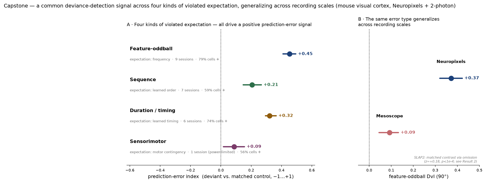

The project's five prediction-error results, on one axis. Each row of panel A is a
different way of making a stimulus *unexpected*; the index is the deviant response
relative to a physically-matched control (bounded −1…+1, so techniques and
paradigms are comparable). All four are positive with confidence intervals
excluding zero — the deviance signal does not depend on *how* the expectation was
set:

| error type | expectation set by | PE index | sessions | cells positive |
|---|---|---|---|---|
| **Feature-oddball** | stimulus frequency | **+0.45** | 9 | 79 % |
| **Sequence** | learned temporal order | **+0.21** | 7 | 59 % |
| **Duration / timing** | learned interval timing | **+0.32** | 6 | 74 % |
| **Sensorimotor** | motor–visual contingency | **+0.09** | 1 (power-limited) | 56 % |

Panel B shows the feature-oddball form generalizing across recording scales
(Neuropixels DvI +0.37, mesoscope +0.09; SLAP2 via the matched omission contrast).
The sensorimotor row is deliberately flagged: its designed closed-loop/open-loop
contrast is only cleanly computable in one high-locomotion session (see Result 3),
so it enters this summary as suggestive, not established. The full logic, controls,
and caveats for each row are in the Result sections below.

The plotted indices are in [`data/capstone_error_types.csv`](data/capstone_error_types.csv)
and [`data/capstone_crossscale.csv`](data/capstone_crossscale.csv); each is recomputed
from its paradigm's per-unit table by the corresponding Result notebook
(`oddball_confirmatory_ecephys`, `sequence_mismatch_ecephys`, `duration_mismatch_ecephys`,
`sensorimotor_mismatch_ecephys`, and the cross-scale set), which stream the NWB files
directly from DANDI.

## What's in this repository

The core toolkit turns the preliminary Allen CCF alignment packaged into the DANDI
NWB files into two reusable products:

1. **Attachable CCF sidecars** — small per-session Parquet tables (one per unit,
   one per channel) that carry area / layer / coarse group / CCF coordinates,
   keyed to the NWB `units` and `electrodes` row indices. Join them onto any
   SUA / MUA / LFP / CSD analysis with a single `attach()` call.
2. **Penetration figures** — a 3D render of the probe tracks inside a translucent
   Allen brain, and a per-probe laminar cross-check that overlays CCF region/layer
   boundaries on spontaneous LFP band power and MUA depth profiles, so the
   alignment can be validated against the recordings.

Alongside these are the **validation** and **prediction-error** notebooks
documented below, each of which doubles as a worked example of streaming and
analyzing a given modality. The first prediction-error analysis is
**pre-registered** ([`docs/oddball_analysis_plan.md`](docs/oddball_analysis_plan.md)):
it commits the H0/H1 hypotheses, the adaptation-vs-deviance control, response
windows, and statistics before any confirmatory p-value exists.

## Dataset at a glance

The community project spans **three recording modalities** and **four
predictive-processing paradigms**. The matrix shows what is available so far
(sessions / mice per cell; CCF = sessions with preliminary Allen CCF alignment):

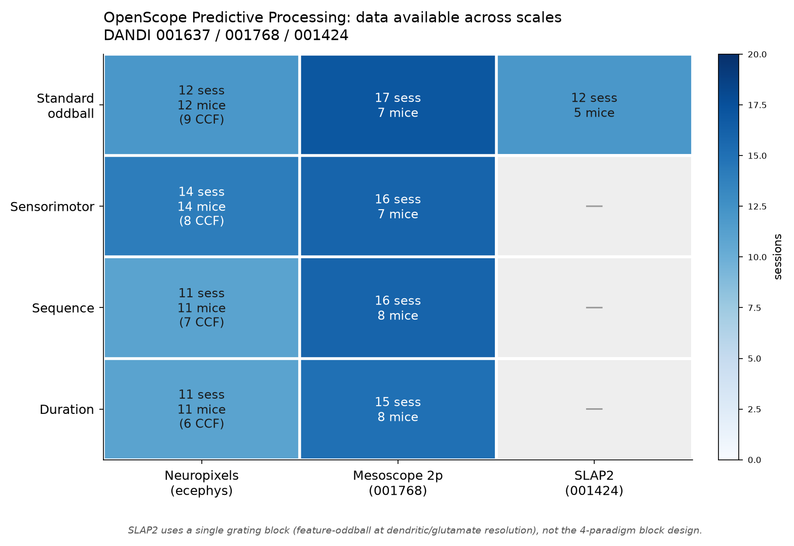

- **Neuropixels** (DANDI 001637) and **Mesoscope 2p** (001768) carry all four
  paradigms with an identical named-block design (including an open-loop
  prerecorded control block).
- **SLAP2** (001424) stores its stimuli as a single monolithic `gratings` stream
  rather than named blocks. It contains an embedded **orientation oddball** (a
  dominant standard orientation with rarer deviants and omissions) plus tuning and
  RF blocks, recoverable by segmenting the stream on orientation statistics — a
  standard/feature-oddball contrast at dendritic glutamate (iGluSnFR) resolution.
  The full four-paradigm SLAP2 set is expected in a later release.
- The **standard / feature oddball** (rare orientation deviant vs. frequent
  standard) is the one contrast expressible in all three modalities; sensorimotor,
  sequence, and duration exist in Neuropixels and mesoscope only.

## Data particulars & gotchas (read before analyzing)

Non-obvious properties of the data that cost real debugging time; several silently
produce wrong-but-plausible results. If you are an analyst — human or LLM — picking
this up cold, read this first.

**Access.** The clean HDF5 NWB files live on DANDI (001637 / 001768 / 001424); the
same data is also on `s3://aind-open-data` as `.nwb.zarr`. We stream the DANDI
HDF5 over HTTP (`remfile` + `h5py`) rather than downloading — see `nwbio.py`. No
DANDI credentials are needed for these public dandisets.

**Stimulus blocks (Neuropixels & mesoscope).** Stimuli are organized into named
`intervals` blocks, easy to misread:
- `Control block 1` (`standard_control`) — the **14-direction drifting-grating
  sweep** used for tuning, *and* the **equiprobable "many-standards" control** for
  the oddball analysis (all orientations equally likely, so a given orientation is
  rare but not surprising). *Not* a mismatch block.
- `Control block 4` (`open_loop_prerecorded`) — the **open-loop comparator** for
  the sensorimotor paradigm (same stimuli, motor coupling removed).
- `Standard mismatch block` — the oddball block; `Orientation`, `TrialType`,
  `contrast` columns define standard vs. deviant vs. omission. Gratings recur on a
  **fixed ~701 ms cycle** (367 ms grating + ~334 ms gap), contiguously.
- Column names are **capitalized** (`Orientation`, `TemporalFrequency`), and
  orientations are in **radians**, not degrees.

**Direction ≠ orientation.** The 14-condition sweep is **drifting** gratings
(`TemporalFrequency = 2 Hz`), which measure **direction** tuning over 0–360°. There
is **no static-grating orientation sweep** in this dataset. Report DSI as measured;
OSI is only obtainable by *folding* the curve 360°→180°. Calling the
drifting-grating result "orientation tuning" is the mistake to avoid.

**Ecephys electrode/unit mapping.** `units.extremum_channel_index` is a
**per-probe** index (0–~382), but the `electrodes` table **stacks all probes**.
Indexing `electrodes` directly assigns every unit to the first probe. Correct
mapping (add the per-probe row offset) lives in `nwbio.unit_electrode_rows()`.
`units.device_name` is a per-session device identifier, **not** an anatomical
label — get area/layer from CCF. Real CCF alignment is present in **30 of 48**
usable ecephys sessions (`electrodes.location`/`x`/`y`/`z` populated); the rest
carry placeholder `"unknown"` locations.

**CCF acronyms encode area *and* layer.** `electrodes.location` gives e.g. `VISp5`
(area `VISp`, layer `5`), `DG-mo`, `CA1` (a hippocampal subfield, *not* a layer),
or a fiber-tract code like `fi`. `ccf.py` decodes these; `electrodes.x/y/z` are
absolute CCF µm, while `units.estimated_x/y/z` are probe-local relative coordinates.

**SLAP2 is structurally different.** All stimuli sit in one monolithic
`intervals/gratings` table (no named blocks); segment it by stimulus statistics.
Three imaging quirks, all load-bearing:
- **Two DMD paths** (`Fluorescence_DMD1` / `Fluorescence_DMD2`) image
  **simultaneously** with a small fixed onset offset (DMD1 ≈ +0.115 s).
- A DMD's **stored timestamps can be compressed** (e.g. labeled over ~1000 s when
  the recording is ~3020 s). Because the two DMDs are simultaneous, rebuild the bad
  timebase as a uniform axis over the *other* DMD's intact span.
- **RF/tuning yield varies strongly across sessions.** Pick a good session before
  judging the modality (we use sub-796630 2025-10-01 DMD1). One early format
  (sub-794237) differs and is skipped.

---

## Validation — the pipeline reads real visual signals

Before any prediction-error claim, the full pipeline (stream NWB → align to trials
→ extract response) is checked against two known answers that a real visual neuron
must satisfy: a compact spatial receptive field, and direction/orientation
selectivity. Both pass in all three modalities.

### Receptive fields

Using each dataset's `RF mapping` block, we recover clean, retinotopically
localized receptive fields — spikes (Neuropixels), somatic ΔF/F (mesoscope), and
dendritic glutamate ΔF/F (SLAP2):

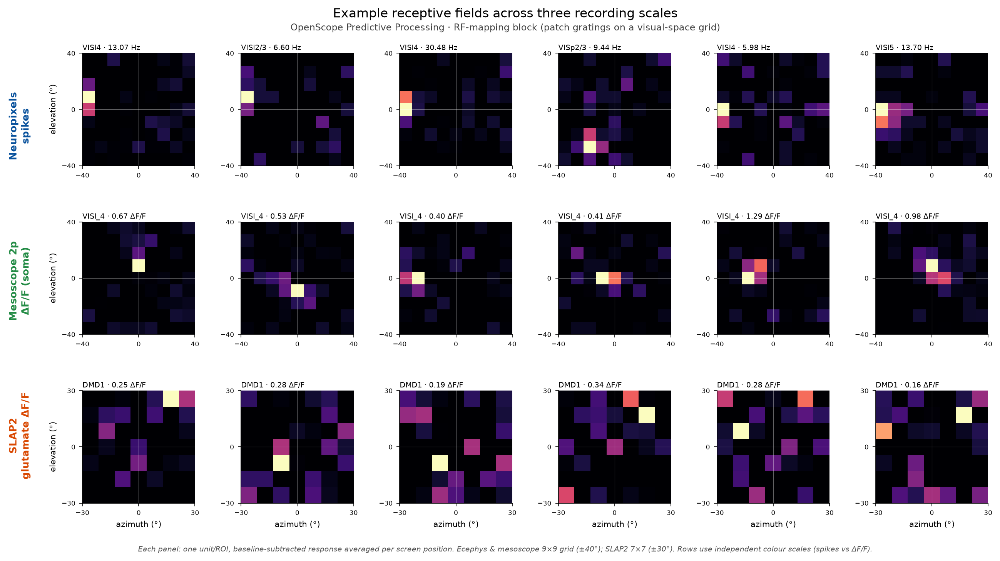

Each panel is one unit/ROI selected by **2-D Gaussian fit quality** (R²), with a
diverging colour map centred at zero and a black half-maximum contour; titles give
the fitted RF width. Widths are mouse-appropriate (median FWHM ≈ 25° ecephys, 18°
mesoscope, 15° SLAP2). We deliberately do **not** rank by peak/std "SNR" (biased
toward spiky one-pixel maps) nor render with `vmin=0` (crushes the graded surround
to black) — both make real RFs look artificially point-like.

**Are these RFs real, or just structure we selected for?** Because the examples are
hand-picked, we test against three noise controls that do not depend on the
selection: split-half reliability, a per-unit trial-label permutation null, and a
negative control (non-visual units for ecephys; responses re-aligned to random
times for imaging).

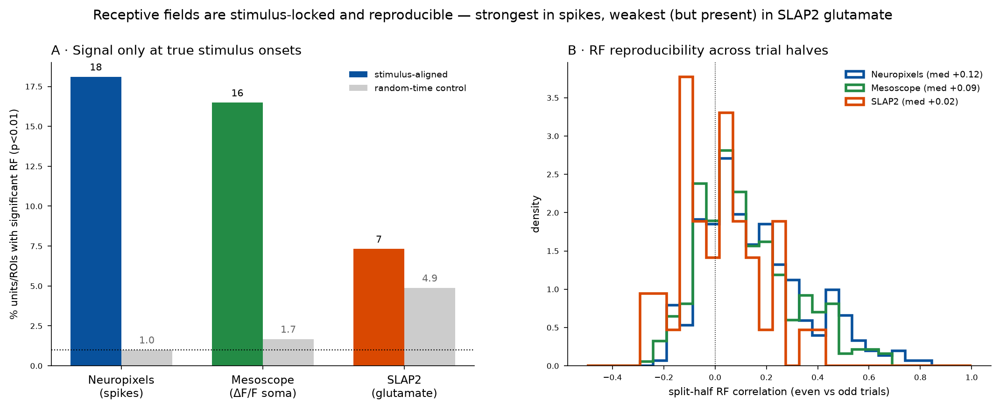

The RFs are stimulus-locked and reproducible: 16–18 % of units/ROIs carry a
significant RF at true onsets in Neuropixels and mesoscope, collapsing to ~1–2 %
(chance) in the controls — and for ecephys the significant RFs concentrate in
visual cortex and thalamus while motor cortex and hippocampus sit at chance. SLAP2
glutamate shows a real but weaker population effect (7 % vs. 5 % control; the panel
uses an earlier low-yield session, so 7 % is a conservative lower bound). Reproduce:
[`notebooks/rf_sanity_check_three_modalities.ipynb`](notebooks/rf_sanity_check_three_modalities.ipynb).

### Direction tuning

Each session's `Control block 1` carries a full **14-direction drifting-grating
sweep** (0–315° in 22.5° steps, TF = 2 Hz). We report **DSI** as the primary metric
and **OSI** only as a value *derived* by folding the curve 360°→180° — not as a
static-grating measurement (see gotcha above).

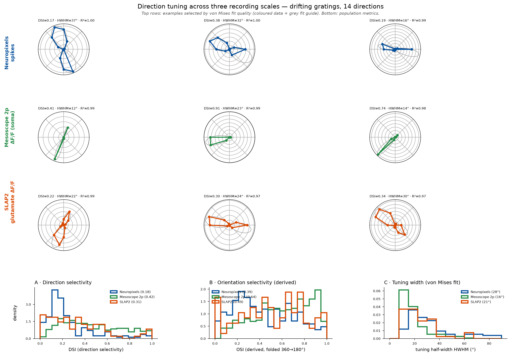

| Modality | median DSI | OSI (derived) | tuning HWHM | % direction-selective |
|---|---|---|---|---|
| Neuropixels (spikes) | 0.18 | 0.39 | 28° | 11 % |
| Mesoscope (ΔF/F soma) | 0.42 | 0.64 | 16° | 53 % |
| SLAP2 (glutamate) | 0.31 | 0.49 | 21° | 24 % |

All three show well-formed tuning with realistic half-widths (16–28° HWHM).
Examples are selected by **von Mises fit quality** (not by a selectivity index,
which over-selects near-line curves), and we report the fitted width so narrow
curves are shown as narrow rather than driving the selection. RF mapping validates
*spatial* sensitivity; direction tuning validates *feature* sensitivity — together
the pipeline reads real visual signals at all three scales. Reproduce:
[`notebooks/direction_tuning_three_modalities.ipynb`](notebooks/direction_tuning_three_modalities.ipynb).

---

## Result 1 — Feature-oddball prediction error (Neuropixels)

Does a rare *oddball* orientation drive a genuine **prediction error**, or merely
**stimulus-specific adaptation** of the fatigued frequent standard? This distinction
is the whole game. To separate them we compare the deviant not against the standard
but against the **same grating shown equiprobably** in the `standard_control` block —
physically identical, equally rare, but *not* surprising. The **deviance index**
`DvI = (oddball − equiprobable control)/(|oddball|+|control|)` is therefore
adaptation-free; the naive `OI = (oddball − standard)/…` is reported alongside.

Pooling the **9 CCF-labelled standard-oddball sessions** (9 mice), with
session-stratified bootstrap CIs and FDR correction across the area × layer grid:

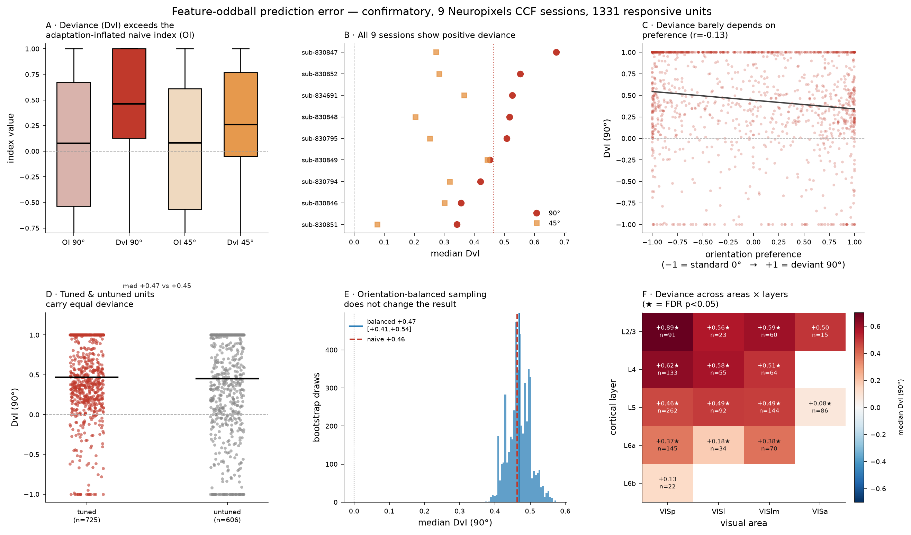

- **Pooled DvI₉₀ = +0.46** (95% CI +0.42…+0.50, p ≈ 7×10⁻¹¹⁰) and **DvI₄₅ = +0.26**
  (p ≈ 3×10⁻⁵⁸) — both far above the adaptation-inflated naive OI ≈ +0.08. **All 9
  sessions** are positive (panel B); the effect is not driven by one animal.
- **Deviance is not a tuning artifact.** DvI₉₀ barely depends on a unit's
  orientation preference (r = −0.13, panel C); tuned and untuned units carry equal
  deviance (+0.47 vs +0.45, panel D); and resampling to equalize the
  preferred-orientation distribution leaves the median unchanged (+0.47 balanced vs
  +0.46 naive, panel E).
- **A broadcast signal, not a compartment.** Deviance is significant (FDR p<0.05) in
  **13/15** area × layer cells, with a superficial-heavy gradient (L2/3 ≈ +0.68 →
  L6a ≈ +0.37; panel F).

A single example session (sub-830851, 141 responsive visual units) shows the same
structure at the individual level — the 90° oddball exceeds both the identical
equiprobable control and the frequent standard, the deviance is present in the
adaptation-free DvI (not just the naive OI), and it scales with feature distance
(orthogonal 90° strongly significant, median DvI ≈ +0.34, p ≈ 9×10⁻⁹; intermediate
45° not):

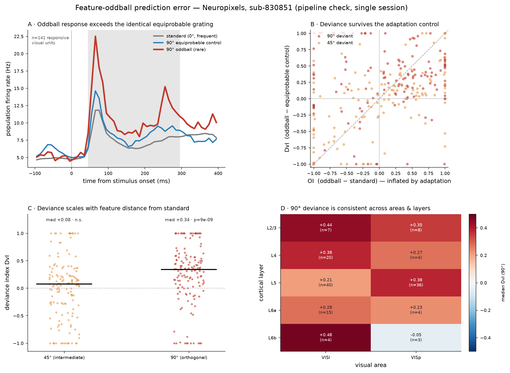

The example is worked end-to-end in
[`notebooks/oddball_prediction_error_ecephys.ipynb`](notebooks/oddball_prediction_error_ecephys.ipynb);
the confirmatory pool is in
[`notebooks/oddball_confirmatory_ecephys.ipynb`](notebooks/oddball_confirmatory_ecephys.ipynb).

### Population dynamics and laminar timing

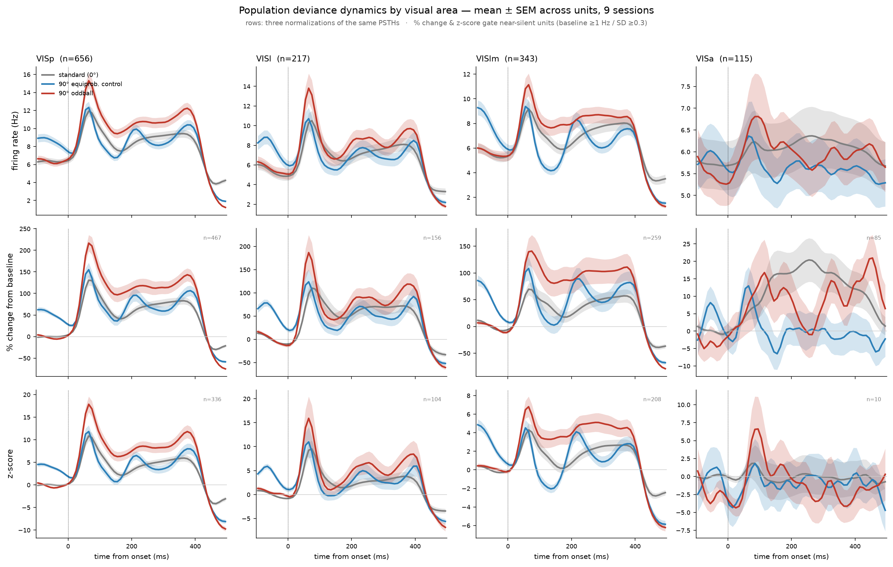

Mean ± SEM PSTHs per visual area in three normalizations (absolute Hz, % change,
z-score): the oddball rides above both the standard and the physically-identical
equiprobable control throughout the evoked response. *(% change / z-score gate out
units below 1 Hz baseline / 0.3 Hz SD, where those normalizations explode.)*

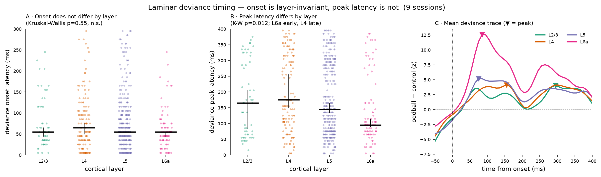

Per-unit latency by layer: **onset is layer-invariant** (~55–65 ms,
Kruskal-Wallis p = 0.55) but **peak latency is not** (p = 0.012; L6a peaks early
~95 ms, L4 late ~175 ms). The layers begin responding together and differ in how
quickly the signal peaks — not in when it starts.

### A second error type — omission

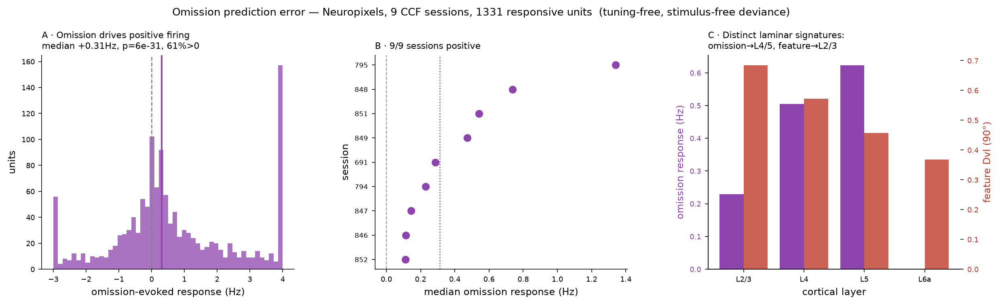

The **omission** deviant (a withheld expected grating) is a *tuning-free,
stimulus-free* prediction error: any positive response is error by construction.
Omission drives positive firing (pooled +0.31 Hz, p ≈ 6×10⁻³¹, 61 % of units > 0,
positive in **all 9** sessions).

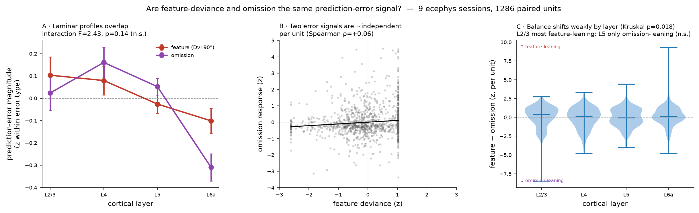

Are feature-deviance and omission the *same* signal? On the same units: their
laminar profiles overlap (layer × error-type interaction n.s., F = 2.4, p = 0.14,
panel A), but the two are **nearly independent at the single-unit level** (Spearman
ρ = +0.06, panel B) with only weak laminar modulation of the balance (panel C). The
interpretation is a *middle* position: overlapping populations and layers, but
**largely different units** carrying the two error types.

---

## Result 2 — The prediction-error signal generalizes across recording scales

The same feature-oddball and omission contrasts, measured in mesoscope 2p
(jGCaMP8s) and SLAP2 (iGluSnFR) as well as spikes. Two measurement decisions make
the comparison fair (details in *Cross-technique methods* below): responses are
integrated on **responsive cells only** over **one stimulus cycle** (spikes 0–500 ms,
calcium 0–700 ms), because population-mean traces are dominated by ongoing activity
and the ~701 ms grating cycle caps the isolatable window.

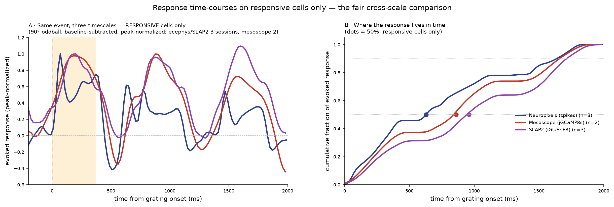

On responsive cells the timescales order sensibly by indicator kinetics (spikes
peak ~70 ms, iGluSnFR ~200 ms, jGCaMP8s ~880 ms), but the cumulative-response curves
show ≥90 % of each response is captured within ~1700 ms — so a per-cycle window
treats all three fairly. Reproduce:
[`notebooks/crossscale_timescales.ipynb`](notebooks/crossscale_timescales.ipynb).

### The finding

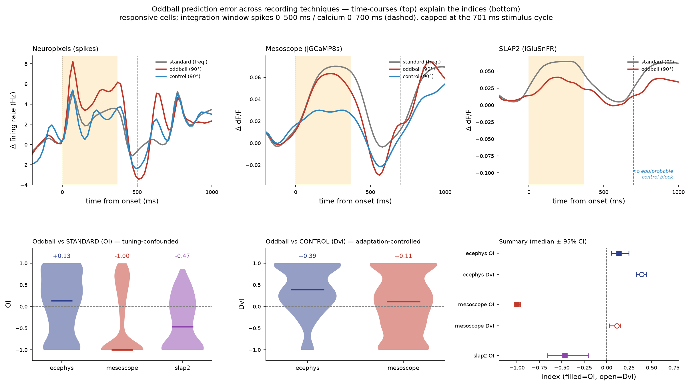

- The adaptation-controlled **DvI stays positive wherever it can be computed** —
  **+0.39** spikes, **+0.11** mesoscope (all sessions positive). SLAP2 has no
  equiprobable control block, so DvI is not computable there.
- The naive **OI reverses sign** — mildly positive in spikes (+0.13), strongly
  negative in both calcium methods (−1.00 mesoscope, −0.47 SLAP2). **This reversal
  is a population-sampling artifact, not a real difference** — the raw OI must never
  be compared across techniques that sample cells differently (see *Cross-technique
  methods*). Reproduce:
  [`notebooks/crossscale_oddball_index.ipynb`](notebooks/crossscale_oddball_index.ipynb).

### Omission across scales

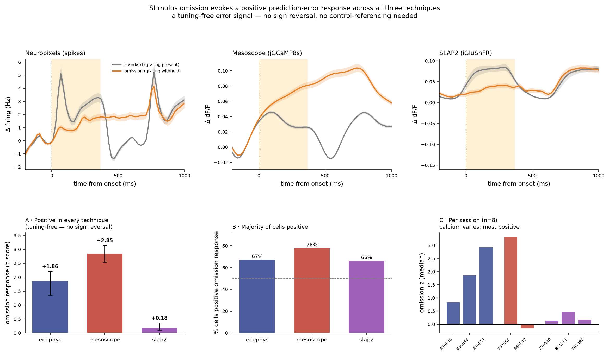

Omission is **tuning-free**, so it sidesteps the sampling artifact entirely — the
response reads directly off the raw population of each technique, with no
control-referencing or balancing needed.

| technique | omission response | z-score (95% CI) | p | % cells positive |
|---|---|---|---|---|
| Neuropixels | +0.40 Hz | **+1.86** [+1.36, +2.21] | 5.7e-19 | 67 % |
| Mesoscope | +0.052 dF/F | **+2.85** [+2.54, +3.14] | 1.8e-93 | 78 % |
| SLAP2 | +0.011 dF/F | **+0.18** [+0.11, +0.36] | 9.8e-05 | 66 % |

The omission trace rises above the standard in every technique — no sign reversal,
because omission has no stimulus orientation to bias which cells respond.
Session-to-session variability is shown honestly (calcium varies more than ephys;
SLAP2's contrast-0 blanks are not a paradigm-matched mismatch block, its weakest
leg). Reproduce:
[`notebooks/omission_crossscale.ipynb`](notebooks/omission_crossscale.ipynb).

### Bottom line for H0/H1

Two error types (feature-oddball, tuning-controlled; omission, tuning-free), and —
for the oddball — **three independent confound-free routes** (control-referenced
DvI, tuning-free omission, and responsiveness×tuning-balanced OI), all yield a
**positive prediction-error response at every recording scale**. One direction of
effect across scales, error types, and confound controls is a substantially
stronger footing for a **common** deviance-detection mechanism (H1) than any single
contrast. Results 3–5 extend this to three further kinds of violated expectation
(motor contingency, sequence order, timing); the combined five-way picture is in
[**Results at a glance**](#results-at-a-glance).

---

## Result 3 — Sensorimotor mismatch (motor-based prediction error)

Results 1–2 test **sensory** prediction error. The sensorimotor paradigm tests a
different prediction: how the animal's own movement should change what it sees.
Visual flow is coupled to running on a wheel (closed loop); a `motor_halt` freezes
the flow mid-run, a `motor_omission` drops it, orientation deviants rotate it — each
violating the **motor–sensory** contingency. The designed control is `Control block 4`
(`open_loop_prerecorded`): the identical visual events played back **decoupled** from
running, so *closed-loop − open-loop* isolates the motor-based error.

**This paradigm is power-limited by locomotion, and we report it honestly.** A
motor–sensory mismatch only exists while the animal runs, but these mice are
stationary most of the time (median speed 0; running >1 cm/s in 5–49 % of the session
for 7 of 8 mice), and the open-loop control block has only **8 events per type**.
Running has to coincide with those 8 events — across 8 CCF sessions it does so cleanly
in only one (sub-830794). So we give two contrasts of differing power.

### Within-block deviance — well-powered (8 sessions)

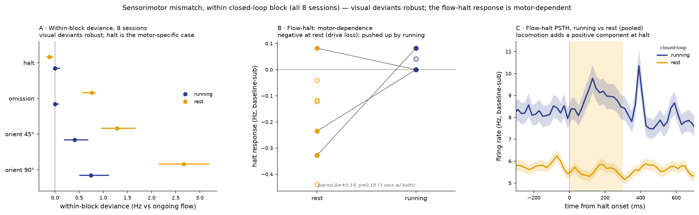

Each deviant's response is measured against the ongoing standard flow (the pre-event
window *is* the standard). All three visual/omission deviants drive robust responses,
confirming deviance detection operates in the sensorimotor block as it does in the
standard-oddball block — on >1300 units across 8 mice:

| deviant | running (median) | rest (median) | p (rest) | % positive |
|---|---|---|---|---|
| orientation 90° | +0.75 Hz | +2.67 Hz | ~1e-101 | 77 % |
| orientation 45° | +0.40 Hz | +1.29 Hz | ~1e-68 | 71 % |
| omission | ~0 Hz | +0.76 Hz | ~1e-61 | 65 % |

(Deviance is larger at rest because locomotion elevates the ongoing baseline the
deviant is measured against; both states are highly significant.)

The **flow-halt is the one purely motor-contingent event**, and it behaves unlike the
visual deviants (panels B–C): at rest, halting the flow *reduces* firing (median
−0.12 Hz, negative in 6 of 7 sessions — freezing the flow removes visual drive), but
during running that response is pushed up toward positive. A locomotion-dependent
positive component at the halt is the signature of a motor-based prediction error.
It is directionally consistent (paired +0.14 Hz, running > rest) but underpowered —
only 3 sessions carry both running and rest halts (p = 0.18).

### Closed-loop vs open-loop — the designed contrast, single powered session

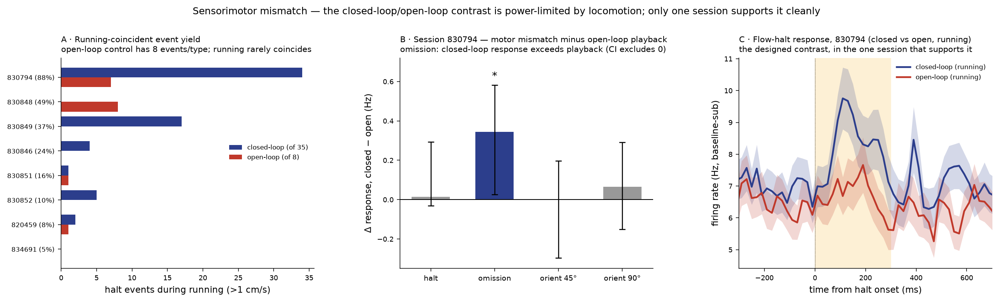

Where the fully-designed contrast is computable (sub-830794, which ran 88 % of the
session), the **omission** closed-loop response significantly exceeds the open-loop
playback (Δ = +0.35 Hz, 95 % CI [+0.03, +0.58]), while the purely-visual orientation
deviants — which carry information with or without the motor loop — show no
closed/open difference. The halt points the same way (Δ = +0.01 Hz) but its CI crosses
zero, so it is suggestive, not significant. That dissociation (motor-contingent events
differ from playback, purely-visual events don't) is exactly the motor-prediction
signature, but it rests on one mouse.

**Bottom line:** the sensorimotor block *confirms* deviance detection at the population
level and is *consistent with* a motor-based prediction error in the two places it can
be measured, without yet establishing the latter at population scale — an honest
boundary set by the released data (low locomotion, small control block), not the
analysis. It awaits sessions with more running. Reproduce:
[`notebooks/sensorimotor_mismatch_ecephys.ipynb`](notebooks/sensorimotor_mismatch_ecephys.ipynb).


---

## Result 4 — Sequence mismatch (prediction error in a learned temporal sequence)

Results 1 and 3 define "expected" by frequency (standard-oddball) or motor contingency
(sensorimotor). The sequence paradigm defines it by **learned temporal order**: a fixed
4-element sequence **90° → 45° → 0° → 45°** (each element 267 ms), repeated ~1250 times per
session, so the 3rd element (0°) becomes *predicted* by the two before it. Deviants (35 each)
replace that expected 3rd element with an orientation shift (45°/90°), a blank, or a flow-halt.

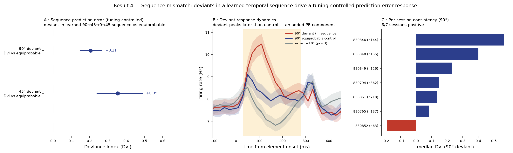

**Tuning-controlled result.** A raw "90°-deviant vs expected-0°" contrast is confounded by
orientation preference (V1 cells respond more to 90° than 0°). We remove it with the same DvI
logic as Result 1 — comparing the sequence deviant to the *physically identical* grating shown
equiprobably in the `sequential_control_block` (matched 0.25 s, TF = 2 Hz), where the same
orientation carries no sequence expectation:

| deviant | DvI (vs equiprobable) | 95 % CI | p | sessions positive |
|---|---|---|---|---|
| 90° | **+0.21** | [+0.15, +0.27] | 7e-11 | 6/7 |
| 45° | **+0.35** | [+0.24, +0.49] | 5e-06 | 6/7 |

A positive DvI means the *sequential context*, not the orientation, drives the extra response.
The dynamics confirm it: the deviant response peaks later (~110 ms) than the equiprobable control
(~50 ms), a prediction-error component riding on top of the sensory drive — the same signature as
the standard-oddball, now with expectation set by learned order rather than frequency.

**Not overclaimed.** The `sequence_omission` trial type (position 5) is the *fixed* blank ending
every sequence (present in 100 % of them), not a violation — its negative response is loss of
visual drive. And the expected in-sequence 0° is less suppressed than an equiprobable 0° (+0.23),
which resembles predictive suppression but cannot be separated from adaptation to the specific
preceding element, so we rest the result on the confound-controlled DvI. Reproduce:
[`notebooks/sequence_mismatch_ecephys.ipynb`](notebooks/sequence_mismatch_ecephys.ipynb).


---

## Result 5 — Duration / timing mismatch (a temporal prediction-error signal)

Despite its name, the "duration" block tests **temporal-interval (timing) expectation**. The
standard is a metronomic cadence — a 367 ms grating every **701 ms**, all at 0° — so the animal
learns exactly *when* the next grating will appear. Deviants perturb the timing: `jitter` makes the
grating arrive early (500 ms) or late (850 / 1370 ms), and `omission` withholds it entirely.

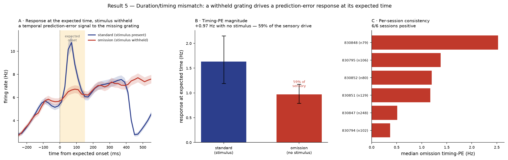

**A withheld stimulus drives a response at its expected time.** When the expected grating is
omitted, the population still produces activity **at the expected onset** — +0.97 Hz (95 % CI
[+0.79, +1.17], p ≈ 9e-60, 74 % of cells positive, 6/6 sessions), which is **~59 % of the
magnitude of the actual sensory response** to a present grating. Panel A shows it directly: the
standard and omission traces rise together on the shared cadence entrainment, then the standard
shoots to its sensory peak while the omission — with no stimulus at all — still shows a clear
positive deflection in the expected window.

**Onset-locked, not entrainment.** The effect survives comparison to the immediately-preceding
window (a positive *step* at the expected onset, +0.33 Hz, p ≈ 2e-25), so it is locked to when the
stimulus should have appeared, not merely the rising cadence ramp.

**On the jitter.** We examined early/late jitter but do not report a scalar contrast for it: a
mistimed grating shifts the analysis window into the tail of the previous grating's response,
contaminating the baseline in a way a simple response−baseline measure can't cleanly separate from
the timing effect. The omission has no such confound (no stimulus, no sensory response to
contaminate), so we rest the result there.

Activity generated by the *absence* of an expected event, keyed purely to learned timing, is the
strongest form of a prediction-error signal — a fourth error type pointing the same way as the
others. Reproduce:
[`notebooks/duration_mismatch_ecephys.ipynb`](notebooks/duration_mismatch_ecephys.ipynb).

---

## Cross-technique methods — why the raw numbers mislead, and how we correct

The single most important thing to understand before comparing responses across
these three techniques: **they do not sample neurons the same way**, so a raw
response comparison across them is not meaningful. This section measures the
difference and gives the correction — the reusable methodological core of the
oddball work.

### Why the mesoscope differs — four compounding factors

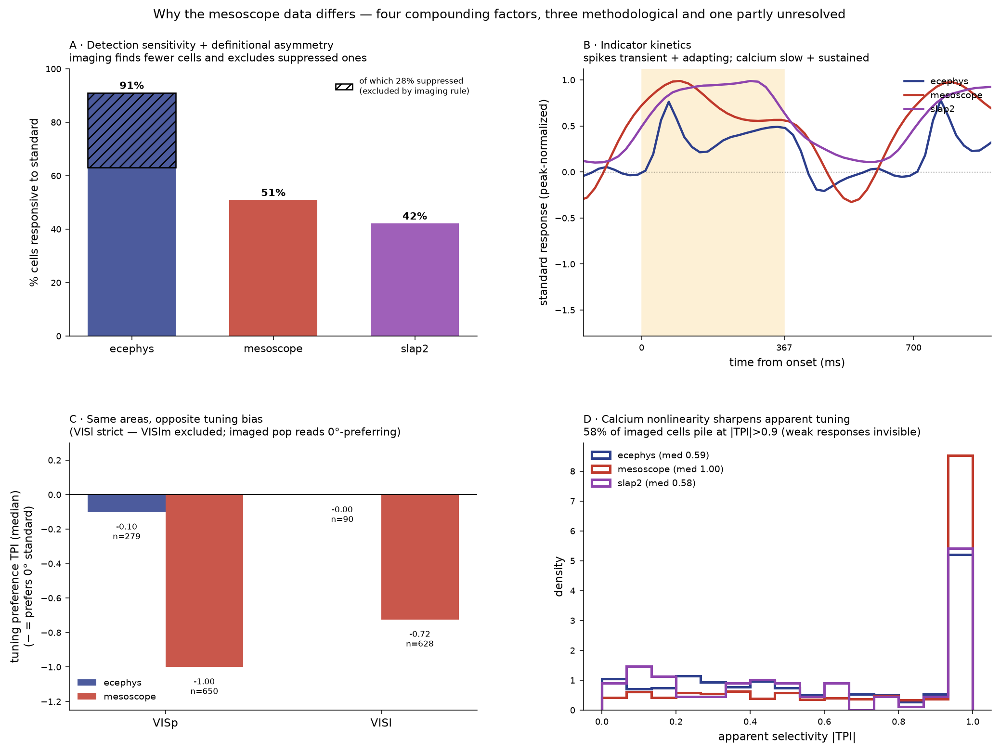

1. **Detection sensitivity.** Neuropixels finds ~91 % of visual units responsive to
   the standard; mesoscope ~51 %, SLAP2 ~42 %. Calcium imaging only sees cells whose
   spiking crosses the indicator threshold, dropping the weakly-driven majority.
2. **A definitional asymmetry.** The ephys responsiveness rule (Wilcoxon p<0.05)
   admits suppressed-by-standard cells (28 % of responsive ephys units); the imaging
   rule (p<0.05 **and mean>0**) excludes them.
3. **Indicator kinetics.** Spikes are transient and adapting; calcium is slow and
   sustained. The standard trace dips below baseline late in ephys but stays
   elevated in calcium.
4. **Calcium nonlinearity sharpens apparent tuning.** 58 % of mesoscope cells pile
   at |TPI|>0.9 vs 37 % in ephys — a cell responds to its preferred orientation and
   goes *invisible* for the orthogonal one, saturating the tuning index toward ±1.
   (The mesoscope images depths 62–385 µm, superficial through L5, so this is *not* a
   layer artifact — it is technique-intrinsic.)

### The mechanism of the OI reversal — a tuning-sampling effect

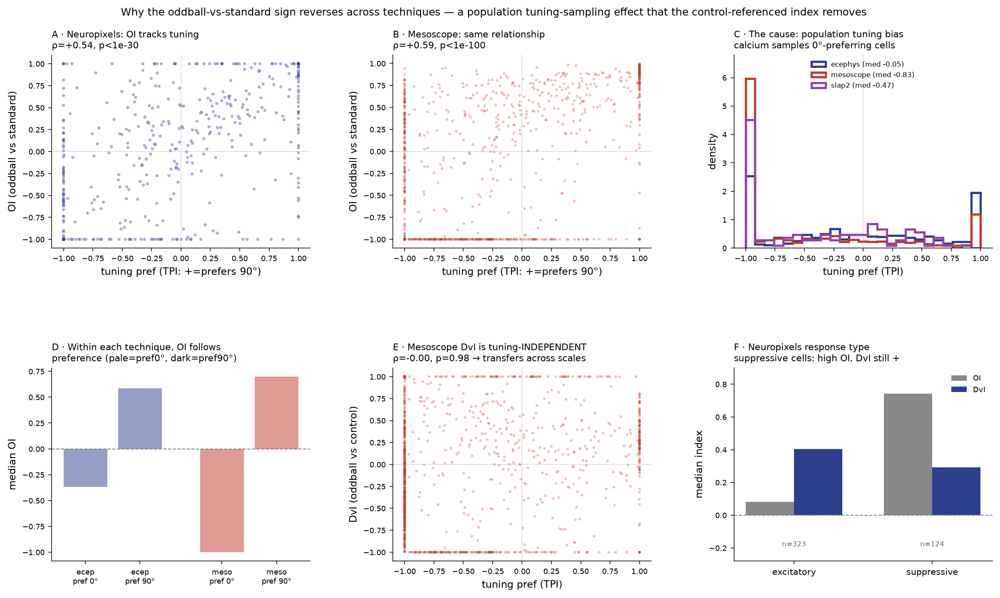

Factor 4 is the proximate cause of the −1.00 raw mesoscope OI, and the mechanism is
clean: **OI tracks each cell's orientation preference**, measured *independently* in
the control block (TPI: +1 = prefers the 90° deviant orientation, −1 = prefers the
0° standard). Within *every* technique, OI correlates with TPI (Neuropixels ρ =
+0.54, mesoscope ρ = +0.59, both p ≪ 1e-30). Two-photon imaging over-samples
0°-preferring cells (mesoscope median TPI −0.83 vs Neuropixels −0.05), which drags
the population-median OI negative even though individual cells obey the same law —
split by preference, the reversal vanishes (0°-cells negative, 90°-cells positive in
*both* techniques). The adaptation-controlled **DvI is tuning-independent** (ρ =
−0.00, p = 0.98), which is exactly why it transfers across scales and OI does not.

### The correction principle — match responsiveness AND tuning

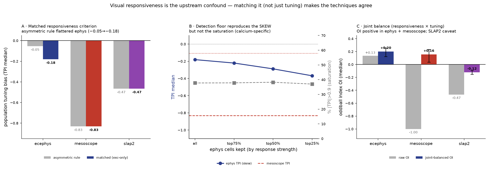

> **Cross-technique comparisons must be matched on both what fraction of cells you
> detect (the responsiveness floor) and which cells among them you keep (the tuning
> distribution).** Controlling tuning alone is insufficient, because the detection
> threshold silently pre-selects a tuning-biased subset.

Three levels, applied to the feature-oddball index:

1. **Matched responsiveness criterion.** Applying the same excitatory-only rule to
   all three techniques moves the ephys tuning bias from −0.05 to −0.18 — the
   asymmetric rule had flattered ephys. DvI is untouched (+0.39 → +0.40).
2. **Detection-floor test.** Restricting ephys to progressively
   stronger-responding cells *trends* its tuning bias toward the mesoscope's (TPI
   −0.18 → −0.37 at the strongest quartile), showing the skew is partly a shared
   detection-threshold effect. The imaging-matched ~50 % fraction alone does **not**
   flip ephys OI negative (still +0.03); only a stricter cut does. The calcium
   *saturation* (|TPI|>0.9 ≈ 58 %) is not reproduced at any ephys threshold — that
   piece is calcium-specific.
3. **Joint balancing (responsiveness × tuning).** Balancing on both flips the
   mesoscope OI from −1.00 to **+0.16** (95 % CI [+0.04, +0.23]) and gives ephys
   +0.20 — both positive under the fully-matched comparison. (An independent
   tuning-only balancing gives the same qualitative flip; see
   [`notebooks/subsample_tuning_balanced.ipynb`](notebooks/subsample_tuning_balanced.ipynb).)

**SLAP2 caveat throughout:** with no equiprobable control block, its tuning index
and its oddball index derive from the same 0°-vs-90° comparison, so the two cannot
be separated there (balanced OI stays −0.12). The clean dissociation rests on
Neuropixels + mesoscope; SLAP2's positive evidence is the tuning-free omission.

### Time series, and the adaptation control for omission

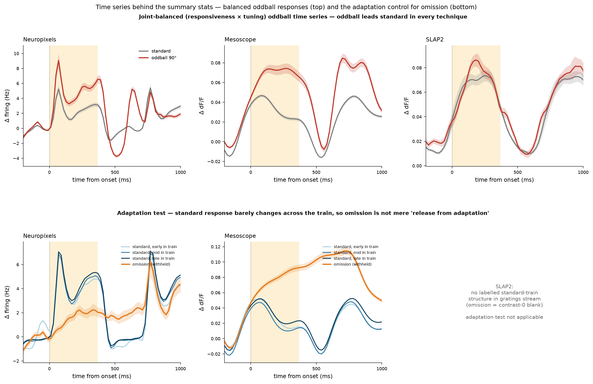

Summary indices can mislead, so the joint-balanced result is also shown as
time-courses (top row): the oddball leads the standard throughout the window in
every technique, including the mesoscope whose raw OI was −1.00.

The bottom row is the **adaptation control** for the omission response — the
alternative a reviewer would raise: is the large, positive mesoscope omission
response merely *release from adaptation*? If so, the standard should decline across
the standard train and the omission should not exceed the un-adapted (early)
standard. **Neither holds.** Splitting the standard by train position, the traces
are essentially superimposed — no adaptation (mesoscope 0.018 → 0.016 → 0.022 dF/F;
ephys 4.1 → 4.6 Hz) — and the omission (0.088 dF/F) exceeds even the earliest,
least-adapted standard (0.018) by ~4–5×. There is no adaptation to release from, and
the response dwarfs what it would release toward: an active, positively-signed
prediction-error signal. Full analysis:
[`notebooks/crosstechnique_corrections.ipynb`](notebooks/crosstechnique_corrections.ipynb).

---

## Why a CCF package

The raw NWB CCF fields are awkward to use directly for the two reasons detailed in
*Data particulars* above — the acronyms need decoding into area + layer + tissue
class, and the per-probe `extremum_channel_index` must be offset before indexing
the stacked `electrodes` table. This package handles both once (`ccf.py`,
`nwbio.unit_electrode_rows()`) and ships the results as attachable sidecars, so
every downstream analysis inherits correct anatomy without re-solving them.

## Install

```bash
pip install -e .
```

## Quick start

```python
import openscope_ccf as o

idx = o.load_session_index()          # registry of CCF-labeled sessions
row = idx.iloc[0]
tag = f"{row.subject}_{row.date}"

# 1. Build attachable sidecars for a session
o.build_session_sidecars(row.aid, str(row.subject), row.date, row.paradigm)

# 2. Annotate any unit-level result
annotated = o.attach(my_sua_df, tag, on="unit_index")      # adds area, layer, group, ccf_xyz
# ...or any channel-level (LFP/CSD) result:
annotated = o.attach(my_lfp_df, tag, on="channel", kind="channels")

# 3. Penetration figures
pd_ = o.build_probe_data(row.aid)
o.make_3d(pd_, tag, "fig_3d.png", brain_mesh=o.load_root_mesh())
o.make_laminar(pd_, tag, "fig_laminar.png")
```

## Colab

`notebooks/ccf_penetration_figures.ipynb` runs the whole flow for any session on
free Colab CPU (data is streamed, not downloaded).

## Batch

```bash
python scripts/build_all.py --sidecars --figures --out data/
```

## Layout

```
openscope_ccf/          package
  ccf.py                CCF acronym decoder
  nwbio.py              DANDI streaming + corrected unit→electrode mapping
  sidecar.py            build/load/attach sidecar tables
  figures.py            build_probe_data, make_3d, make_laminar
  data/ccf_session_index.csv   registry of CCF sessions
  data/sidecars/          prebuilt per-session sidecars (Parquet), shipped with the package
notebooks/              Colab notebooks (CCF figures, validation, prediction-error analyses)
scripts/build_all.py    batch driver
```

`load_ccf`/`attach` resolve sidecars from `./data/sidecars` if present, else fall
back to the copy shipped inside the installed package — so they work from a clone
or a bare `pip install`.

## Data & attribution

- Data: OpenScope Community Predictive Processing, [DANDI 001637](https://dandiarchive.org/dandiset/001637).
- CCF alignment: OpenScope community ([discussion #163](https://github.com/AllenNeuralDynamics/openscope-community-predictive-processing/discussions/163)).
- Atlas: `allen_mouse_25um` via [BrainGlobe](https://brainglobe.info/).

## Notebook hygiene (Colab ↔ GitHub)

Saving a notebook from Colab can insert a `metadata.widgets` block without the
required `state` key, which makes GitHub refuse to render it ("Invalid Notebook").
`scripts/clean_notebook.py` strips only that block — **figures and all other
outputs are preserved** (unlike "Clear all outputs", which deletes them).

Two layers keep this automatic:

* **Local pre-commit hook** — `pip install pre-commit && pre-commit install`, then
  every local `git commit` cleans notebooks first (see `.pre-commit-config.yaml`).
* **GitHub Action** — `.github/workflows/clean-notebooks.yml` cleans and commits
  back on any pushed notebook, which covers saving from Colab straight to GitHub
  (that path bypasses local hooks).

## License

MIT — see [LICENSE](LICENSE).
