# ai_oscp_neuro

Analysis toolkit and cross-scale validation for the **OpenScope Community
Predictive Processing** dataset — Allen Institute for Neural Dynamics.

> Python package `openscope_ccf` — import name is `openscope_ccf`; the GitHub
> repository is `maierav/ai_oscp_neuro`.

[](https://colab.research.google.com/github/maierav/ai_oscp_neuro/blob/main/notebooks/ccf_penetration_figures.ipynb)

## Background & motivation

The [OpenScope Community Predictive Processing](https://allenneuraldynamics.github.io/openscope-community-predictive-processing/)
project asks how the brain implements **predictive processing** — whether the
cortex learns to predict upcoming sensory input and signals *prediction errors*
when reality violates expectation. The central question is whether different kinds
of violation (a sensory oddball, a broken sensorimotor contingency, an omitted
stimulus) are computed by **distinct specialized circuits** (H0) or by a **common
canonical mechanism** repeated across the brain (H1). To decide between them, the
same battery of "mismatch" paradigms is recorded at **three spatial scales in mouse
visual cortex**, so error signals can be compared from single spikes up to
population and dendritic activity. The conceptual and methodological background is
laid out in the community white paper:

> Aizenbud et al. (2025), *Neural mechanisms of predictive processing: a
> collaborative community experiment through the OpenScope program.*
> [arXiv:2504.09614](https://arxiv.org/abs/2504.09614)

**What this repository provides.** (1) A reusable toolkit that makes the
preliminary Allen CCF alignment usable and attachable to any downstream analysis;
(2) a set of pipeline **validations** (receptive fields, direction tuning) that
pass before any prediction-error claim is trusted; and (3) the **prediction-error
analyses** themselves — feature-oddball, omission, sensorimotor, sequence, and
timing — carried across the three recording scales where the paradigm allows,
with the cross-technique confounds explicitly measured and controlled. The
headline scientific result: **three independent kinds of violated expectation —
surprise defined by stimulus frequency, by learned sequence order, and by learned
timing — each evoke a positively-signed prediction-error response** (CIs excluding
zero under a session-level bootstrap), and the feature-oddball form survives three
independent confound controls and shows the same *sign* at a second recording scale
(mesoscope 2p, +0.10 across all four mesoscope mice that carry the paradigm) — a
positive but weaker cross-scale signal that remains **exploratory** rather than an
established replication (see Result 8). The fourth
case we can test — motor–visual contingency (sensorimotor) — is **null in the
released data** (limited by low locomotion and a block-order confound; see Result 3),
so it neither supports nor contradicts the common-mechanism reading. One consistent
direction across the three establishable error types favours the common-mechanism
reading (H1), with the motor case still open pending better-powered data.

## Results at a glance

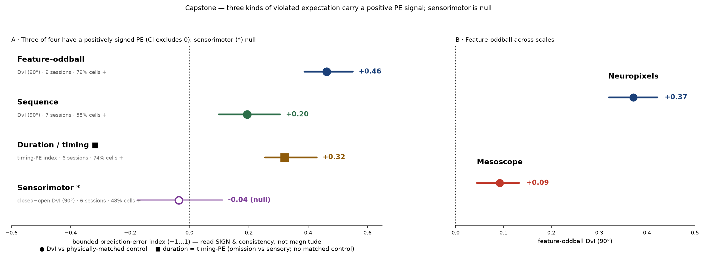

The project's four error-type prediction-error contrasts, on one axis (the eight
numbered Results below expand these plus the cross-scale and anatomical analyses).
Each row of panel A is a different way of making a stimulus *unexpected*, expressed
as a bounded −1…+1 index so the four can share an axis. **The rows are not the
identical construction, and the axis compares direction and consistency, not magnitude
— so the relative bar lengths are deliberately not interpretable as effect-size
ranking.** Three rows (feature-oddball, sequence, sensorimotor, drawn ●) are DvIs — the
deviant response relative to a **physically-matched control stimulus**,
(R_dev−R_ctrl)/(|R_dev|+|R_ctrl|). The duration row (drawn ■, distinct marker) is a
**timing-PE index** — the omission response at the expected onset time (there is *no*
stimulus, so no physically-matched control is possible) normalized by the same units'
**standard sensory response**, om_pe/(|om_pe|+|std_r|). The underlying duration Result
is reported in Hz (+0.97 Hz omission response over +1.63 Hz standard); the +0.32 here
is that ratio put on the bounded scale — its **generating expression now lives in
`duration_mismatch_ecephys.ipynb`** (the `timing_pe_index` cell) and is persisted in
`data/duration_timing_pe.parquet`, so the capstone value is traceable end-to-end. Both
index families are bounded to −1…+1 and both put a surprise-related response over a
response-magnitude denominator, but a duration +0.32 and a feature-oddball +0.43 are
**not the same quantity** (different denominators, different reference). Read the panel
as **"which error types produce a positively-signed PE and how consistently,"** not as
a strength ranking. On that reading, three of four are positive with CIs
excluding zero (sensorimotor is null):

| error type | expectation set by | PE index | 95 % CI (hierarchical) | sessions | cells + |
|---|---|---|---|---|---|
| **Feature-oddball** | stimulus frequency | **+0.43** | [+0.36, +0.54] | 9 | 79 % |
| **Sequence** | learned temporal order | **+0.20** | [+0.10, +0.31] | 7 | 58 % |
| **Duration / timing** | learned interval timing | **+0.32** | [+0.26, +0.43] | 6 | 74 % |
| Sensorimotor *(null)* | motor–visual contingency | −0.04 | [−0.18, +0.11] | 6 | 50 % |

**Three** of the four error types carry a positive prediction-error index with a CI excluding
zero under a session-level (hierarchical) bootstrap. The **sensorimotor row is a null** (−0.04,
CI spans zero; see Result 3) — limited by low locomotion and a block-order confound, so it is
italicised and flagged as null here. So the convergence claim is honest about its scope: deviance
detection appears across
frequency-, order-, and timing-based expectations, while the motor-contingency case is not
established in the released data. Panel B shows the feature-oddball form with the **same positive
sign** at a second recording scale (Neuropixels DvI +0.34 from 3 mice, mesoscope +0.10 from the
**4 mesoscope mice** that carry the standard-mismatch paradigm — the full available cohort; SLAP2
via the matched omission contrast). This remains an **exploratory** two-scale comparison rather than
an established replication: the mesoscope effect is real in sign but ~3× smaller and rests on 4
animals. The full logic, controls, and caveats for each row are in the Result sections below.

> **Unit-inclusion rule per paradigm (they are not identical, by design).** All four start from
> the same base gate — `default_qc` **and** VIS-area — applied in every extractor. On top of that,
> feature-oddball and sensorimotor add a **responsiveness gate** (feature-oddball: Wilcoxon
> `resp_p < 0.05`; sensorimotor: standard evoked rate > 0.1 Hz), while sequence and duration use all
> QC-passing VIS units with no separate responsiveness cut. This difference is deliberate and, for a
> *normalised* index, largely immaterial: a non-responsive unit contributes a near-zero DvI/timing-PE
> (tiny numerator over tiny denominator) and so barely moves the median. We verified this directly —
> adding a responsiveness gate to the two ungated paradigms leaves the headline essentially unchanged
> (**sequence** +0.20 → +0.22, 7/7 mice either way; **duration** +0.32 → +0.32, 6/6 mice either way).
> The feature-oddball number is the one exception where responsiveness matters, and there the gate is
> applied (an all-QC feature-oddball population dilutes the median because ~20 % of VIS units are
> unresponsive to the standard). So the capstone axis compares indices computed on comparable
> populations to within this robustness margin; the per-paradigm gate is stated in each Result
> section and in the extractor cell of each notebook.

**Is any headline carried by one mouse?** The forest below puts the *animal* — not the unit — as
the visible unit of replication for every primary effect: each ● is one mouse's median, ◆ is the
pooled hierarchical-bootstrap CI, ⊢ is the leave-one-animal-out range (how far the pooled estimate
moves when any single mouse is dropped), and the right margin gives an exact sign test on the
per-animal medians (the most conservative honest statistic — N = number of mice).

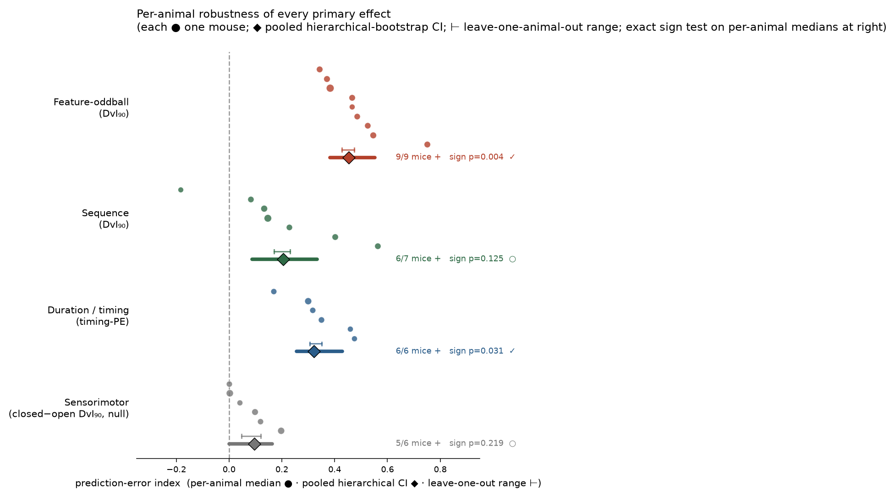

The pattern is honest about its own strength: **feature-oddball** (9/9 mice positive, sign
p = 0.004), **duration/timing** (6/6, p = 0.031), and **sequence** (7/7, p = 0.016) all survive the
exact animal-level test and barely move under leave-one-out; **sensorimotor** (5/6, p = 0.22, the
closed−open index) is consistent with the null in the Result 3 headline. So the three positive
error types are robust at the animal level — not just at the pooled-cell level — and the
sensorimotor case is correctly reported as null rather than established. Values in
[`data/per_animal_effects.csv`](data/per_animal_effects.csv). All three animal-level diagnostics
(this forest, the area×layer animal-support heatmap, and the Result 3 behavioral balance) are
regenerated by
[`notebooks/robustness_diagnostics.ipynb`](notebooks/robustness_diagnostics.ipynb).

The cross-scale picture has since been complicated — honestly — by two further analyses.
Paradigm-matched SLAP2 data has begun to arrive, and a first look at the dendritic-glutamate scale
([**Result 7**](#result-7--paradigm-matched-slap2-first-look-preliminary-n2paradigm)) finds no
prediction-error signal in any of the four paradigms — but at n = 2 sessions each, this cannot
yet separate a genuine input/output dissociation from underpowering. And when the *sequence*
paradigm is broken down by cortical area in both modalities
([**Result 8**](#result-8--sequence-mismatch-a-cross-modality-areal-discrepancy-in-v1)), the
the Neuropixels signal is significantly positive in V1 while the mesoscope signal is a null there:
spiking finds the sequence-PE *significantly positive and strongest* in primary V1 (+0.25), while
mesoscope 2-photon in V1 sits essentially on zero (−0.03, wide CI crossing zero, 4/10 subjects
negative — updated to the full 10-subject cohort now on DANDI). This is a spiking/imaging
**detection** difference, not a sign reversal. Only part of this is explained by mesoscope's
superficial laminar sampling. So the cross-scale
generalization in panel B holds only in *sign* for the *feature-oddball* contrast (spikes +0.34 and
mesoscope +0.10, both positive on responsive cells, mesoscope pooled over all 4 available paradigm
mice) — an **exploratory** agreement, not a quantitative match, and the finer area-resolved
comparison is a **caution against treating the calcium DvI as interchangeable with the spiking
DvI** — where spiking V1 carries a strong deviance signal, 2-photon V1 does not.

"All positive," though, is consistent with **both** a single common deviance-detection
mechanism (**H1**) and separate circuits each tuned to their own error type (**H0**).
[**Result 6**](#result-6--is-there-a-shared-laminar-substrate-across-error-types-h1-test--inconclusive)
tests this anatomically, using the CCF area/layer labels on the five animals recorded
across the feature-oddball, sequence, and duration paradigms. The result is a **negative /
inconclusive** one: the apparent "shared L4–L6 laminar signature" is an artifact of using raw
firing rate (deep layers fire harder) — on the repo's normalized index the feature-oddball
gradient actually *reverses* to superficial-heavy, and the cross-paradigm correlations do not
survive FDR on the n = 10 pooled anatomical cells. So the laminar data **cannot distinguish** a
common H1 substrate from different circuits with positive average responses; the H1 evidence in
this repo rests on the convergent *sign* of prediction error across four paradigms, not on shared
anatomy.

The plotted indices are in [`data/capstone_error_types.csv`](data/capstone_error_types.csv)
and [`data/capstone_crossscale.csv`](data/capstone_crossscale.csv). **The reproducibility chain is
three-stage, and the capstone CSVs are assembled by a script, not by a Result notebook** (an
earlier version of this README implied each notebook wrote its own capstone row — it did not; that
is fixed here):

1. **Per-unit tables** — each Result notebook streams its NWB files from DANDI (with `QUICK=False`,
   the default) and writes the per-unit table it computes: `oddball_confirmatory_units.parquet`,
   `sequence_units.parquet`, `duration_timing_pe.parquet` (carrying `om_pe`, `std_r`, and the bounded
   `timing_pe_index = om_pe/(|om_pe|+|std_r|)`), plus `sensorimotor_multisession_summary.csv` and
   `meso_sequence_dvi.parquet` / `crossscale_mechanism.parquet`.
2. **Table assembly** — [`scripts/build_summary_tables.py`](scripts/build_summary_tables.py) reads
   those per-unit tables and **is the sole generator of both capstone CSVs** — the committed
   `data/capstone_*.csv` files *are* this script's output, not a separate snapshot. It applies **one
   named analysis population per result** (recorded in the CSV's `population` column and in
   `summary_tables_provenance.json`): feature-oddball = QC & VIS & **responsive** (`resp_p<0.05`),
   sequence = QC & VIS, duration = QC & VIS, sensorimotor = QC & VIS & **standard-responsive**
   (>0.1 Hz, read from its own gated notebook summary). `--check` re-runs the build and asserts
   **both** committed CSVs (error-types *and* cross-scale) equal a fresh rebuild across **every row
   and every column** — numeric fields (median, CI, n, n_sess, frac_cells_pos, frac_animals_pos, p)
   within 1e-6, string fields (metric, population) exactly, and it fails explicitly on a missing/extra row, a sign flip,
   or a CI-zero-crossing change (a CI that gains or loses zero). It passes
   exactly, because there is no intentional snapshot/script divergence. The numbers change only when
   a Result notebook rewrites its per-unit table (e.g. a DANDI draft re-upload); the fix is then to
   re-run this builder so the CSVs stay in lock-step, and `--check` passes again. Provenance
   (git SHA, package versions, per-source-table SHA-256, seed, bootstrap N, and the population map)
   is written to `data/summary_tables_provenance.json`.
3. **Figure** — [`notebooks/capstone_synthesis.ipynb`](notebooks/capstone_synthesis.ipynb) renders
   the two CSVs (no NWB streaming).

## What's in this repository

The preliminary Allen CCF alignment now ships **inside** the DANDI NWB files
(`electrodes.location`/`x`/`y`/`z`), but two properties make it awkward to use directly: the
acronyms need decoding into area + layer + tissue class, and the per-probe
`extremum_channel_index` must be offset before it indexes the stacked `electrodes` table
(see *Data particulars*). The core toolkit solves both once and turns the result into two
reusable products:

1. **Attachable CCF sidecars** — small per-session Parquet tables (one per unit,
   one per channel) that carry area / layer / coarse group / CCF coordinates,
   keyed to the NWB `units` and `electrodes` row indices. Join them onto any
   SUA / MUA / LFP / CSD analysis with a single `attach()` call. **30 of the 58
   CCF sessions ship prebuilt sidecars** in `data/sidecars/`; for any other
   indexed session, `build_session_sidecars(...)` (or `scripts/build_all.py
   --sidecars`) builds it on demand by streaming the NWB, and `load_ccf` raises
   a message pointing there if a sidecar is missing.
2. **Penetration figures** — a 3D render of the probe tracks inside a translucent
   Allen brain, and a per-probe laminar cross-check that overlays CCF region/layer
   boundaries on spontaneous LFP band power and a summed sorted-unit rate depth
   profile (a coarse spatial cross-check, not true MUA), so the alignment can be
   validated against the recordings.

Alongside these are the **validation** and **prediction-error** notebooks
documented below, each of which doubles as a worked example of streaming and
analyzing a given modality. The first prediction-error analysis is
**pre-registered** ([`docs/oddball_analysis_plan.md`](docs/oddball_analysis_plan.md)):
it commits the H0/H1 hypotheses, the adaptation-vs-deviance control, response
windows, and statistics before any confirmatory p-value exists.

## Dataset at a glance

The community project spans **three recording modalities** and **four
predictive-processing paradigms**. The matrix shows what is available so far
(sessions / mice per cell; CCF = sessions with Allen CCF alignment). Counts
were verified by a direct scan of all three dandisets on 2026-08-05
(`data/modality_paradigm_provenance.json` records the per-session
classification; regenerate with the paradigm-classification logic in
`scripts/rebuild_session_index.py`):

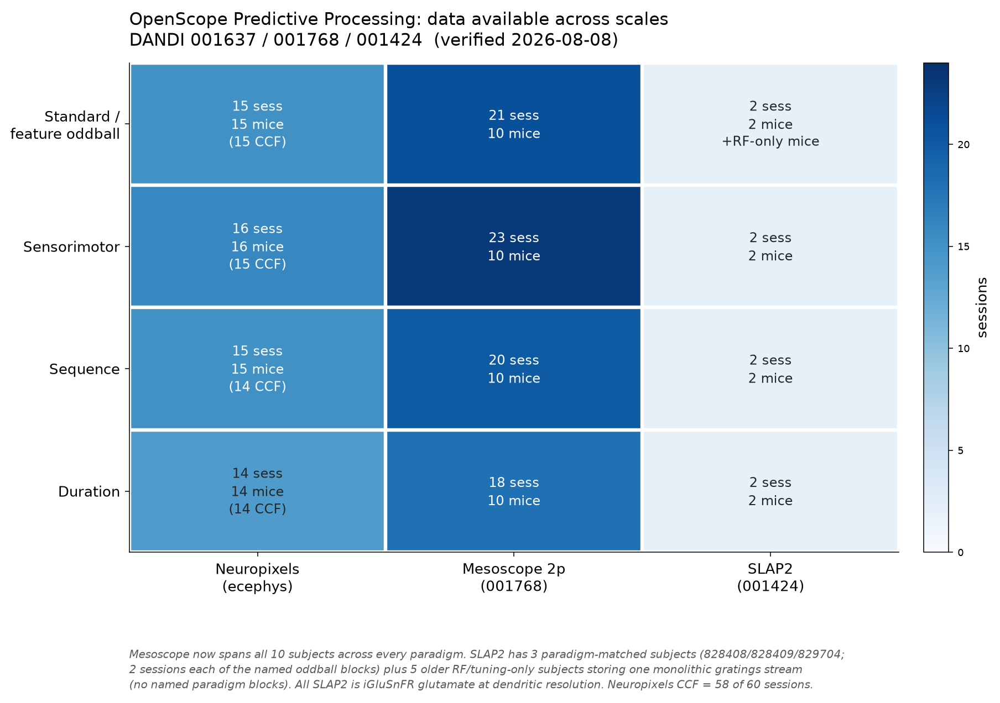

- **Neuropixels** (DANDI 001637, 60 sessions / 58 with CCF, 16 mice) and **Mesoscope 2p**
  (001768, 82 sessions across **10 mice**) carry all four paradigms with an identical named-block
  design (including an open-loop prerecorded control block). Mesoscope now spans all 10 subjects in
  every paradigm (18–23 sessions per paradigm — verified against DANDI 2026-08-08).
- **SLAP2** (001424, 20 sessions, 8 mice) is in transition between two formats. **3 paradigm-matched
  subjects** (828408 / 828409 / 829704) use the **same named-block design** as the other two
  modalities — 2 sessions each of standard-oddball, sensorimotor, sequence, and duration — so the
  four-paradigm SLAP2 set that was "expected in a later release" has begun to arrive (this is the
  set Result 7 uses, still n=2/paradigm). The remaining **5 subjects** store all stimuli in a single
  monolithic `stimulus_presentations` gratings stream (†) with no named paradigm blocks (RF/tuning
  format); these were used for the RF and orientation-tuning validation, not for the paradigm
  analyses. All SLAP2 is iGluSnFR glutamate at dendritic resolution.
- The **standard / feature oddball** (rare orientation deviant vs. frequent
  standard) is expressible in all three modalities. Sequence and duration are
  well-powered in Neuropixels; the sensorimotor contrast is present but
  locomotion-limited (its multi-session effect is null — see Result 3); the SLAP2
  versions (2 sessions each) are new and preliminary.

## Data particulars & gotchas (read before analyzing)

Non-obvious properties of the data that cost real debugging time; several silently
produce wrong-but-plausible results. If you are an analyst — human or LLM — picking
this up cold, read this first.

**Access.** The clean HDF5 NWB files live on DANDI (001637 / 001768 / 001424); the
same data is also on `s3://aind-open-data` as `.nwb.zarr`. We stream the DANDI
HDF5 over HTTP (`remfile` + `h5py`) rather than downloading — see `nwbio.py`. No
DANDI credentials are needed for these public dandisets.

**Stimulus blocks (Neuropixels & mesoscope).** Stimuli are organized into named
`intervals` blocks, easy to misread:
- `Control block 1` (`standard_control`) — the **14-direction drifting-grating
  sweep** used for tuning, *and* the **equiprobable "many-standards" control** for
  the oddball analysis (all orientations equally likely, so a given orientation is
  rare but not surprising). *Not* a mismatch block.
- `Control block 4` (`open_loop_prerecorded`) — the **open-loop comparator** for
  the sensorimotor paradigm (same stimuli, motor coupling removed).
- `Standard mismatch block` — the oddball block; `Orientation`, `TrialType`,
  `contrast` columns define standard vs. deviant vs. omission. Gratings recur on a
  **fixed ~701 ms cycle** (367 ms grating + ~334 ms gap), contiguously.
- Column names are **capitalized** (`Orientation`, `TemporalFrequency`), and
  orientations are in **radians**, not degrees.

**Direction ≠ orientation.** The 14-condition sweep is **drifting** gratings
(`TemporalFrequency = 2 Hz`), which measure **direction** tuning over 0–360°. There
is **no static-grating orientation sweep** in this dataset. Report DSI as measured;
OSI is only obtainable by *folding* the curve 360°→180°. Calling the
drifting-grating result "orientation tuning" is the mistake to avoid.

**Ecephys electrode/unit mapping.** `units.extremum_channel_index` is a
**per-probe** index (0–~382), but the `electrodes` table **stacks all probes**.
Indexing `electrodes` directly assigns every unit to the first probe. Correct
mapping (add the per-probe row offset) lives in `nwbio.unit_electrode_rows()`.
`units.device_name` is a per-session device identifier, **not** an anatomical
label — get area/layer from CCF. **Match `device_name` to the electrode
`group_name` by exact equality, never by substring** — a substring match (e.g.
`device[-1].lower() in group.lower()`) maps `ProbeE` onto `ProbeB` and mislabels
8–16 % of units per session. The correct mapping (add the per-probe row offset)
lives in `nwbio.unit_electrode_rows()`; all notebooks use it.

**Statistics — pooled p-values measure effect *presence*, not cross-animal
robustness.** The tiny Wilcoxon/bootstrap p-values quoted per result (e.g. Result 1's
p ≈ 7×10⁻¹¹⁰) pool units across animals and treat them as independent — they show the
pooled deviant response differs from control, nothing about generalisation across mice.
For cross-animal robustness weigh the **hierarchical-bootstrap CI** (resample sessions,
then units) and the **per-animal-positive fraction** (`frac_animals_pos`) reported
alongside each result; those are the numbers that count. The capstone table carries both
`frac_cells_pos` (share of units with a positive index) and `frac_animals_pos` (share of
mice whose per-animal median is positive) as **separate columns** — never mixed — and the
capstone figure annotates the cell-level fraction uniformly across all four rows. Per-bin
area×layer FDR grids likewise pool units and are descriptive (which bins are positive),
not mouse-level inference.

**CCF is present in 58 of 60 ecephys sessions** (`electrodes.location`/`x`/`y`/`z`
populated — the 58 rows shipped in `ccf_session_index.csv`); the rest carry
placeholder `"unknown"` locations and omit `x`/`y`/`z`.
**Status is per-session, not per-subject** — `sub-832691` has one `"unknown"` session
and one fully-aligned session, so never infer a session's alignment from a sibling.
Regenerate the registry with `python scripts/rebuild_session_index.py`.

**DANDI asset ids are not stable — resolve by path, not by id.** 001637 is
draft-only (no published version), and re-uploading a session file mints a *new*
asset id while dropping the old one from the draft's asset list (the old id still
resolves but is orphaned). The session **path** is stable across re-uploads, so
every notebook resolves `(subject, date) -> current asset id` at run time via
`resolve_asset()` rather than hard-coding an id. The shipped
`ccf_session_index.csv` `aid` column is a snapshot; call
`load_session_index(refresh_aids=True)` to re-resolve all ids from the live
dandiset (adds `aid_changed` and `aid_unresolved` flags), or `openscope_ccf.open_session(subject,
date)` to stream a session id-free. This is why an `aid` in the index can differ
from a fresh `rebuild_session_index.py` sweep without any data having changed.

**CCF acronyms encode area *and* layer.** `electrodes.location` gives e.g. `VISp5`
(area `VISp`, layer `5`), `DG-mo`, `CA1` (a hippocampal subfield, *not* a layer),
or a fiber-tract code like `fi`. `ccf.py` decodes these; `electrodes.x/y/z` are
absolute CCF µm, while `units.estimated_x/y/z` are probe-local relative coordinates.

**SLAP2 is structurally different.** All stimuli sit in one monolithic
`intervals/gratings` table (no named blocks); segment it by stimulus statistics.
Three imaging quirks, all load-bearing:
- **Two DMD paths** (`Fluorescence_DMD1` / `Fluorescence_DMD2`) image
  **simultaneously** with a small fixed onset offset (DMD1 ≈ +0.115 s).
- A DMD's **stored timestamps can be compressed** (e.g. labeled over ~1000 s when
  the recording is ~3020 s). Because the two DMDs are simultaneous, rebuild the bad
  timebase as a uniform axis over the *other* DMD's intact span.
- **RF/tuning yield varies strongly across sessions.** Pick a good session before
  judging the modality (we use sub-796630 2025-10-01 DMD1). One early format
  (sub-794237) differs and is skipped.

> **Two independent timing corrections, and a sign caveat.** (1) The **+0.115 s DMD1 onset offset**
> is a real acquisition lag on *every* SLAP2 session; apply it via the shared `SLAP2_DMD1_OFFSET`
> constant, **added to stimulus onsets** (read the dFF ~115 ms after the onset mark), as in the
> validated RF/tuning notebooks. One caveat to know: the older cross-scale notebooks
> (`crossscale_oddball_index`, `omission_crossscale`) instead add the offset to *data timestamps*
> (≈ sampling at `onset − 0.115`), the opposite direction — ~0.23 s apart. The released files can't
> adjudicate the true sign, so the cross-scale Result 2 SLAP2 leg is **sign-unverified on this axis**;
> Results 1/3/4/5/6/8 (Neuropixels/mesoscope) are unaffected. (2) The **compressed-timebase
> reconstruction** is needed *only* when a DMD's stored clock is corrupt — true for the old RF
> sessions (sub-796630/801381) but not for the paradigm-matched Result 7 sessions
> (828408/828409/829704), whose timestamps are clean. The offset shifts the n=2 SLAP2 indices by
> ≤0.2 and does not change the "uninformative at n=2" conclusion.

---

## Validation — the pipeline reads real visual signals

Before any prediction-error claim, the full pipeline (stream NWB → align to trials
→ extract response) is checked against two known answers that a real visual neuron
must satisfy: a compact spatial receptive field, and direction/orientation
selectivity. Both pass in all three modalities.

### Receptive fields

Using each dataset's `RF mapping` block, we recover clean, retinotopically
localized receptive fields — spikes (Neuropixels), somatic ΔF/F (mesoscope), and
dendritic glutamate ΔF/F (SLAP2):

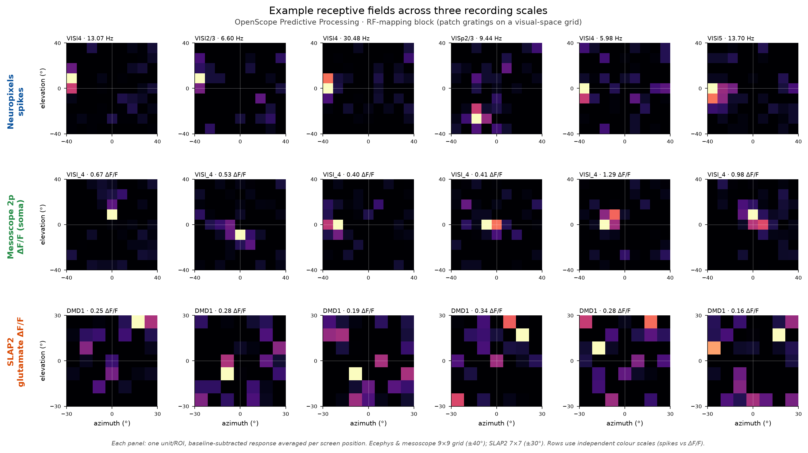

Each panel is one unit/ROI selected by **2-D Gaussian fit quality** (R²), with a
diverging colour map centred at zero and a black half-maximum contour; titles give
the fitted RF width. Widths are mouse-appropriate (median FWHM ≈ 25° ecephys, 18°
mesoscope, 15° SLAP2). We deliberately do **not** rank by peak/std "SNR" (biased
toward spiky one-pixel maps) nor render with `vmin=0` (crushes the graded surround
to black) — both make real RFs look artificially point-like.

**Are these RFs real, or just structure we selected for?** Because the examples are
hand-picked, we test against noise controls that do not depend on the selection:
split-half reliability and a per-unit trial-label permutation null (300 shuffles, p-value
floor 1/301), each run against a **negative control** in which the same responses are
re-aligned to random onset times. The test is **executed live** in the notebook — it builds
the per-trial response matrix for each modality and calls the helpers; the numbers below are
the notebook's output, not a pre-entered table.

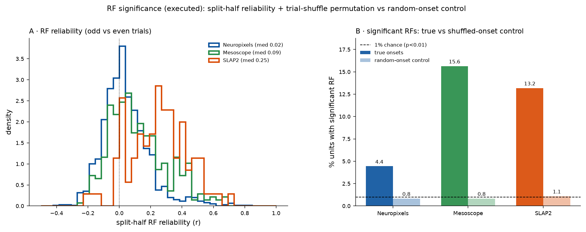

Over **all** quality units/ROIs (no responsiveness pre-selection), at p < 0.01:

| modality | n | median split-half r | % sig (true) | % sig (random-onset control) |
|---|---|---|---|---|
| Neuropixels (spikes) | 1554 | 0.02 | **4.4 %** | 0.8 % |
| Mesoscope (ΔF/F soma) | 358 | 0.09 | **15.6 %** | 0.8 % |
| SLAP2 (glutamate) | 91 | 0.25 | **13.2 %** | 1.1 % |

All three scales sit well above the ~1 % chance rate at true onsets and collapse to ~1 % in the
shuffled-onset control — the dissociation noise cannot produce. Notably the SLAP2 dendritic ROIs
are the **most reliable at the single-ROI level** (median split-half r = 0.25), so its lower
population fraction is a margin statement, not a per-ROI weakness. Reproduce:
[`notebooks/rf_sanity_check_three_modalities.ipynb`](notebooks/rf_sanity_check_three_modalities.ipynb).

### Direction tuning

Each session's `Control block 1` carries a full **14-direction drifting-grating
sweep** (0–315° in 22.5° steps, TF = 2 Hz). We report **DSI** as the primary metric
and **OSI** only as a value *derived* by folding the curve 360°→180° — not as a
static-grating measurement (see gotcha above).

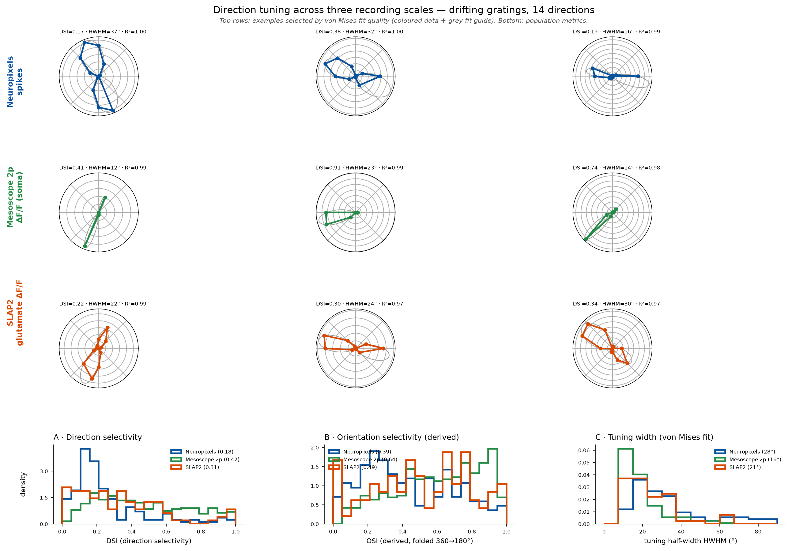

DSI/OSI medians and tuning width (von Mises fit) on the responsive population, with
**direction-selective** now defined and *executed* as **responsive AND DSI above a 300-shuffle null
(p < 0.05)** — not a bare DSI cut:

| Modality | n (resp/total) | median DSI (resp) | OSI (derived, resp) | tuning HWHM | % direction-selective |
|---|---|---|---|---|---|
| Neuropixels (spikes) | 230 / 277 | 0.21 | 0.42 | 28° | 22 % |
| Mesoscope (ΔF/F soma) | 323 / 358 | 0.42 | 0.66 | 16° | 22 % |
| SLAP2 (glutamate) | 80 / 91 | 0.33 | 0.54 | 21° | 52 % |

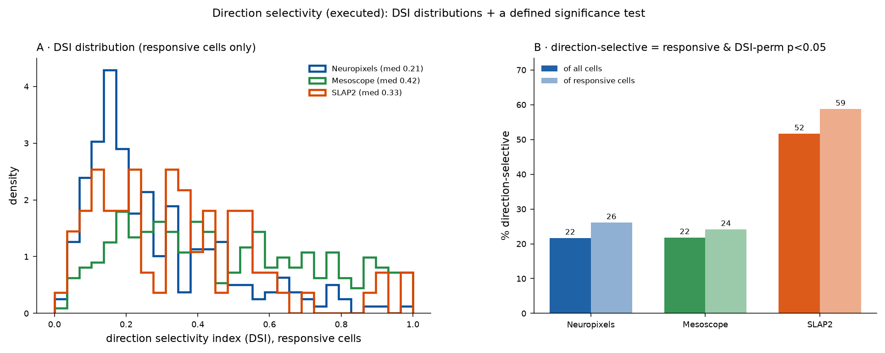

All three show well-formed tuning with realistic half-widths (16–28° HWHM). Examples are selected by
**von Mises fit quality** (not by a selectivity index, which over-selects near-line curves), and we
report the fitted width so narrow curves are shown as narrow rather than driving the selection. The
direction-selective fraction is computed on the responsive population with a permutation test (not a
bare DSI cut), since rectifying noisy near-zero curves would otherwise inflate imaging selectivity.
RF mapping validates *spatial* sensitivity; direction tuning validates *feature* sensitivity —
together the pipeline reads real visual signals at all three scales. Reproduce:
[`notebooks/direction_tuning_three_modalities.ipynb`](notebooks/direction_tuning_three_modalities.ipynb);
values in [`data/direction_selectivity_summary.csv`](data/direction_selectivity_summary.csv).

---

## Result 1 — Feature-oddball prediction error (Neuropixels)

Does a rare *oddball* orientation drive a genuine **prediction error**, or merely
**stimulus-specific adaptation** of the fatigued frequent standard? This distinction
is the whole game. To separate them we compare the deviant not against the standard
but against the **same grating shown equiprobably** in the `standard_control` block —
physically identical, equally rare, but *not* surprising. The **deviance index**
`DvI = (oddball − equiprobable control)/(|oddball|+|control|)` is therefore
adaptation-free; the naive `OI = (oddball − standard)/…` is reported alongside.

Pooling the **9 CCF-labelled standard-oddball sessions** (9 mice), with
session-stratified bootstrap CIs and FDR correction across the area × layer grid:

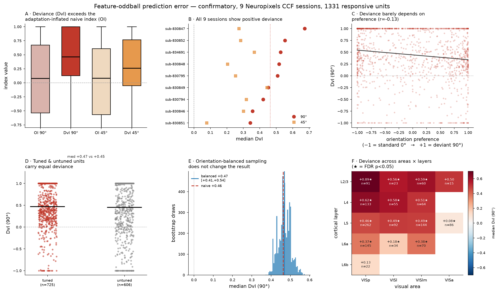

- **Pooled DvI₉₀ ≈ +0.43–0.45** (hierarchical 95% CI ≈ [+0.36, +0.55]) and **DvI₄₅ ≈ +0.27**
  (≈ [+0.17, +0.37]) — both far above the adaptation-inflated naive OI ≈ +0.09. (Point
  estimates drift by ~0.02 as the live DANDI draft re-uploads sessions; the CI covers it.) The
  cross-animal evidence is **9/9 mice positive** (per-subject medians +0.34…+0.75;
  exact sign test **p = 0.0039** for each), which is the number to weigh — *not* the
  pooled per-unit Wilcoxon (p ≈ 7×10⁻¹¹⁰), which treats ~1,600 units from 9 mice as
  independent and so measures effect *presence*, not cross-animal generalisation (see
  the statistics note under *Data particulars*). The hierarchical CI resamples mice, then units.
- **Deviance is not a tuning artifact.** DvI₉₀ barely depends on a unit's
  orientation preference (r = −0.13, panel C); tuned and untuned units carry equal
  deviance (+0.47 vs +0.45, panel D); and resampling to equalize the
  preferred-orientation distribution leaves the median unchanged (+0.47 balanced vs
  +0.46 naive, panel E).
- **A broadcast signal, not a compartment.** Deviance is significant (FDR p<0.05) in
  **13/15** area × layer cells, with a superficial-heavy gradient (L2/3 ≈ +0.68 →
  L6a ≈ +0.37; panel F).

A single example session (sub-830851, 141 responsive visual units) shows the same
structure at the individual level — the 90° oddball exceeds both the identical
equiprobable control and the frequent standard, the deviance is present in the
adaptation-free DvI (not just the naive OI), and it scales with feature distance
(orthogonal 90° strongly significant, median DvI ≈ +0.34, p ≈ 9×10⁻⁹; intermediate
45° not):

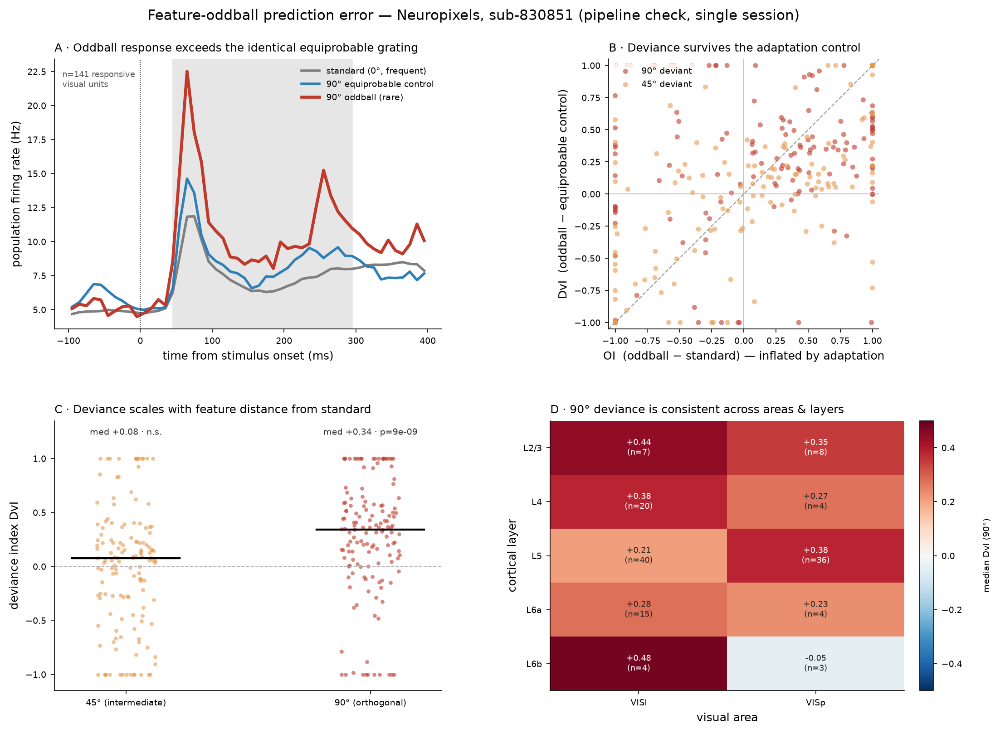

The example is worked end-to-end in
[`notebooks/oddball_prediction_error_ecephys.ipynb`](notebooks/oddball_prediction_error_ecephys.ipynb);
the confirmatory pool is in
[`notebooks/oddball_confirmatory_ecephys.ipynb`](notebooks/oddball_confirmatory_ecephys.ipynb).

**Time-course diagnostic (four-level PSTH).** From the single channel up to the grand
average, each level carries a variance band and the shaded response window:

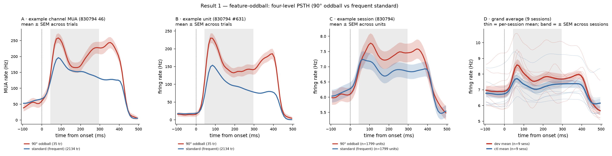

The example channel's multiunit (panel A) is the most direct trigger/timebase check — a
clean onset at t = 0 and the next grating appearing at ~400 ms (the 701 ms cadence) confirm
the alignment. The 90° oddball (red) exceeds the frequent **standard** (blue) at every level,
and all 9 per-session means move together in the grand average (panel D) — the effect is not
carried by one animal, and the response window sits on the peak. **Note on the contrast shown:**
this PSTH plots the oddball against the *frequent standard* — the adaptation view, which makes the
onset/trigger check legible and shows the oddball riding above the fatigued standard response. It
is **not** the equiprobable `standard_control` used for the adaptation-free deviance index (DvI)
above; the standard is more suppressed than the equiprobable control, so this display is, if
anything, a generous upper bound on the raw difference and is shown for its dynamics, not as the
effect-size estimate. Computed by the `MAKE_PSTH_FIG` cell in the confirmatory notebook.

### Population dynamics and laminar timing

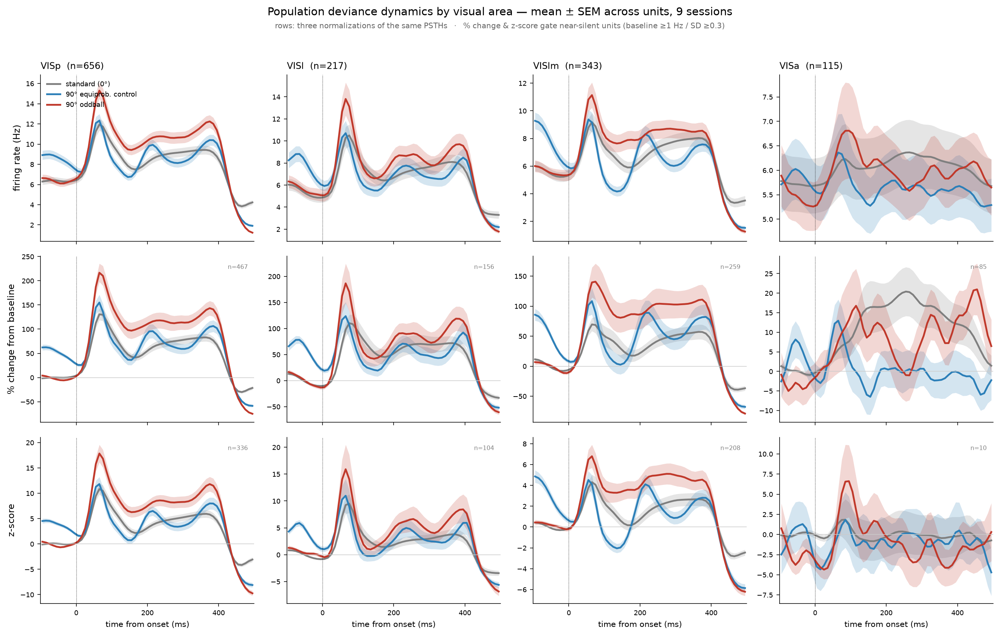

Mean ± SEM PSTHs per visual area in three normalizations (absolute Hz, % change,
z-score): the oddball rides above both the standard and the physically-identical
equiprobable control throughout the evoked response. *(% change / z-score gate out
units below 1 Hz baseline / 0.3 Hz SD, where those normalizations explode.)*

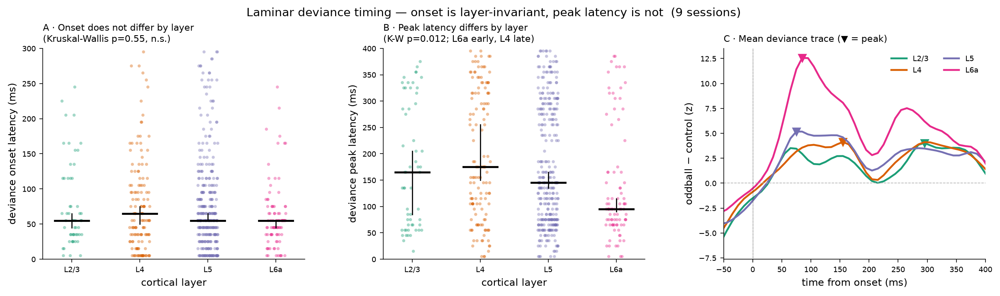

Per-unit latency by layer: **onset is layer-invariant** (~55–65 ms,
Kruskal-Wallis p = 0.55) but **peak latency is not** (p = 0.012; L6a peaks early
~95 ms, L4 late ~175 ms). The layers begin responding together and differ in how
quickly the signal peaks — not in when it starts.

### A second error type — omission

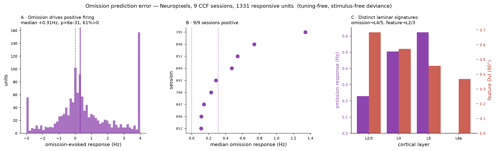

The **omission** deviant (a withheld expected grating) is a *tuning-free,
stimulus-free* prediction error: any positive response is error by construction.
Omission drives positive firing (pooled +0.31 Hz, p ≈ 6×10⁻³¹, 61 % of units > 0,
positive in **all 9** sessions).

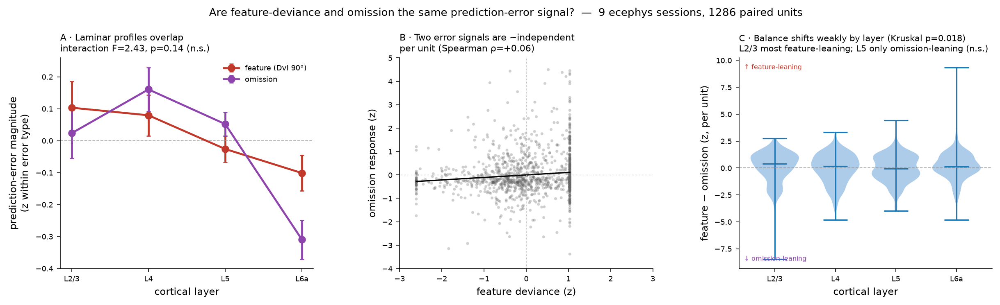

Are feature-deviance and omission the *same* signal? On the same units: their
laminar profiles overlap (layer × error-type interaction n.s., F = 2.4, p = 0.14,
panel A), but the two are **nearly independent at the single-unit level** (Spearman
ρ = +0.06, panel B) with only weak laminar modulation of the balance (panel C). The
interpretation is a *middle* position: overlapping populations and layers, but
**largely different units** carrying the two error types.

---

## Result 2 — The prediction-error signal generalizes across recording scales

The same feature-oddball and omission contrasts, measured in mesoscope 2p
(jGCaMP8s) and SLAP2 (iGluSnFR) as well as spikes. Two measurement decisions make
the comparison fair (details in *Cross-technique methods* below): responses are
integrated on **responsive cells only** over **one stimulus cycle** (spikes 0–500 ms,
calcium 0–700 ms), because population-mean traces are dominated by ongoing activity
and the ~701 ms grating cycle caps the isolatable window.

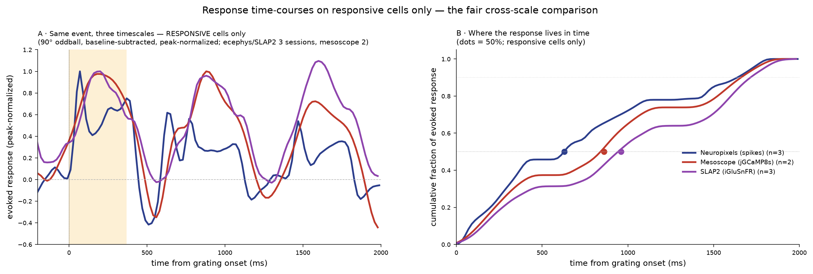

On responsive cells the timescales order sensibly by indicator kinetics (spikes
peak ~70 ms, iGluSnFR ~200 ms, jGCaMP8s ~880 ms), but the cumulative-response curves
show ≥90 % of each response is captured within ~1700 ms — so a per-cycle window
treats all three fairly. Reproduce:
[`notebooks/crossscale_timescales.ipynb`](notebooks/crossscale_timescales.ipynb).

### The finding

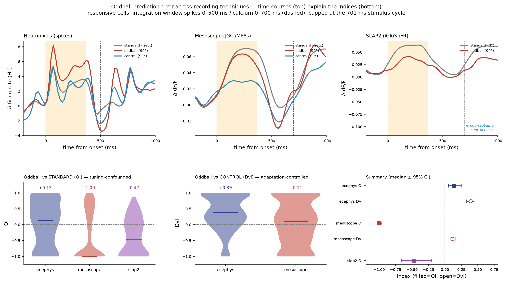

- The adaptation-controlled **DvI stays positive wherever it can be computed** —
  **+0.39** spikes, **+0.11** mesoscope (all sessions positive). SLAP2's *original*
  monolithic sessions had no equiprobable control block, so DvI was not computable there;
  the newer paradigm-matched SLAP2 sessions do, and are analyzed in
  [**Result 7**](#result-7--paradigm-matched-slap2-first-look-preliminary-n2paradigm).
- The naive **OI reverses sign** — mildly positive in spikes (+0.13), strongly
  negative in both calcium methods (−1.00 mesoscope, −0.47 SLAP2). **This reversal
  is a population-sampling artifact, not a real difference** — the raw OI must never
  be compared across techniques that sample cells differently (see *Cross-technique
  methods*). Reproduce:
  [`notebooks/crossscale_oddball_index.ipynb`](notebooks/crossscale_oddball_index.ipynb).

### Omission across scales

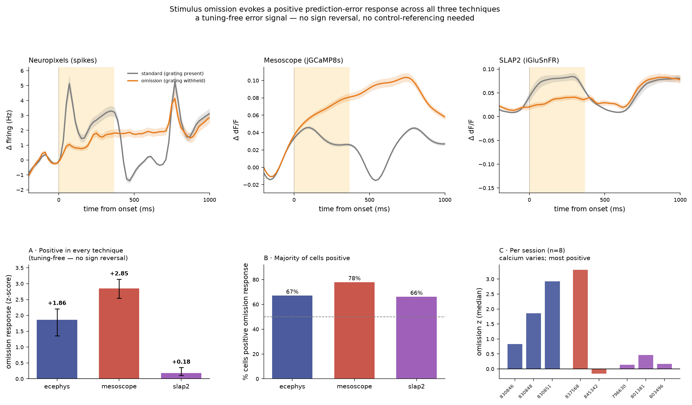

Omission is **tuning-free**, so it sidesteps the sampling artifact entirely — the
response reads directly off the raw population of each technique, with no
control-referencing or balancing needed.

| technique | omission response | z-score (95% CI) | p | % cells positive |
|---|---|---|---|---|
| Neuropixels | +0.40 Hz | **+1.86** [+1.36, +2.21] | 5.7e-19 | 67 % |
| Mesoscope | +0.052 dF/F | **+2.85** [+2.54, +3.14] | 1.8e-93 | 78 % |
| SLAP2 | +0.011 dF/F | **+0.18** [+0.11, +0.36] | 9.8e-05 | 66 % |

The omission trace rises above the standard in every technique — no sign reversal,
because omission has no stimulus orientation to bias which cells respond.
Session-to-session variability is shown honestly (calcium varies more than ephys;
SLAP2's contrast-0 blanks are not a paradigm-matched mismatch block, its weakest
leg). Reproduce:
[`notebooks/omission_crossscale.ipynb`](notebooks/omission_crossscale.ipynb).

### Bottom line for H0/H1

Two error types (feature-oddball, tuning-controlled; omission, tuning-free), and —
for the oddball — **three independent confound-free routes** (control-referenced
DvI, tuning-free omission, and responsiveness×tuning-balanced OI), all yield a
**positive prediction-error response at every recording scale**. One direction of
effect across scales, error types, and confound controls is a substantially
stronger footing for a **common** deviance-detection mechanism (H1) than any single
contrast. Results 3–5 extend this to three further kinds of violated expectation
(motor contingency, sequence order, timing); Result 6 tests H0/H1 anatomically; and
Results 7–8 return to the cross-scale question with newly-arrived paradigm-matched SLAP2
data and an area-resolved mesoscope analysis. The combined four-error-type picture,
plus the cross-scale generalization, is in [**Results at a glance**](#results-at-a-glance).

---

## Result 3 — Sensorimotor mismatch (test of motor-based prediction error — null in released data)

Results 1–2 test **sensory** prediction error. The sensorimotor paradigm tests a
different prediction: how the animal's own movement should change what it sees.
Visual flow is coupled to running on a wheel (closed loop); a `motor_halt` freezes
the flow mid-run, a `motor_omission` drops it, orientation deviants rotate it — each
violating the **motor–sensory** contingency. The designed control is `Control block 4`
(`open_loop_prerecorded`): the identical visual events played back **decoupled** from
running, so *closed-loop − open-loop* isolates the motor-based error.

**This paradigm is power-limited by locomotion, and we report it honestly.** A
motor–sensory mismatch only exists while the animal runs, but these mice are
stationary most of the time (median speed 0; running >1 cm/s in 5–49 % of the session
for 7 of 8 mice), and the open-loop control block has only **8 events per type**.
Running has to coincide with those 8 events — across 8 CCF sessions it does so cleanly
in only one (sub-830794). So we give two contrasts of differing power.

### Within-block deviance — well-powered (8 sessions)

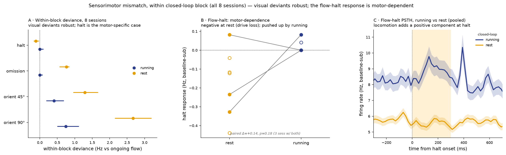

Each deviant's response is measured against the ongoing standard flow (the pre-event
window *is* the standard). All three visual/omission deviants drive robust responses,
confirming deviance detection operates in the sensorimotor block as it does in the
standard-oddball block — on >1300 units across 8 mice:

| deviant | running (median) | rest (median) | p (rest) | % positive |
|---|---|---|---|---|
| orientation 90° | +0.75 Hz | +2.67 Hz | ~1e-101 | 77 % |
| orientation 45° | +0.40 Hz | +1.29 Hz | ~1e-68 | 71 % |
| omission | ~0 Hz | +0.76 Hz | ~1e-61 | 65 % |

(Deviance is larger at rest because locomotion elevates the ongoing baseline the
deviant is measured against; both states are highly significant.)

The **flow-halt is the one purely motor-contingent event**, and it behaves unlike the
visual deviants (panels B–C): at rest, halting the flow *reduces* firing (median
−0.12 Hz, negative in 6 of 7 sessions — freezing the flow removes visual drive), but
during running that response is pushed up toward positive. A locomotion-dependent
positive component at the halt would be *consistent with* a motor-based prediction error,
but the effect is directional only (paired +0.14 Hz, running > rest) and not significant —
only 3 sessions carry both running and rest halts (p = 0.18). Read it as a hint to test with
more data, not as evidence: the properly-powered closed/open contrast (Contrast 3) is null.

### Closed-loop vs open-loop — the designed contrast (6 powered sessions)

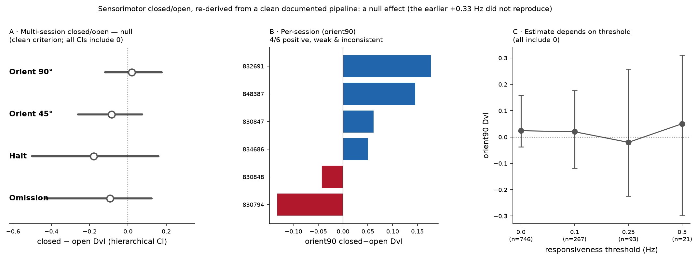

The inclusion rule was pre-committed (§12 of
[`docs/oddball_analysis_plan.md`](docs/oddball_analysis_plan.md)): a session enters iff it has
**≥3 running open-loop events on all four deviant types** (`scripts/audit_locomotion.py` scores
all 16 sessions; six qualify, all with real CCF). The contrast is the per-unit
closed-loop-running minus open-loop-running DvI, pooled with a hierarchical bootstrap. On
QC-passing (`default_qc`), visually-responsive VIS-area units (>0.1 Hz standard evoked rate):

| deviant | closed − open DvI | 95 % CI (hierarchical) | sessions + | reaches sig. |
|---|---|---|---|---|
| Orientation 90° | −0.04 | [−0.18, +0.11] | 4/6 | no |
| Orientation 45° | −0.03 | [−0.17, +0.13] | 3/5 | no |
| Halt | −0.30 | [−0.63, +0.07] | 1/6 | no |
| Omission | −0.09 | [−0.36, +0.09] | 2/5 | no |

**Honest status: null.** No deviant type shows a closed/open prediction-error signal — every CI
includes zero, and per-session estimates are weak and sign-inconsistent. The null is robust to
the responsiveness threshold (taking all QC-passing VIS units gives 0.00 for orientation-90; the
sweep stays null at every cut, −0.04 → −0.04 → +0.05 across >0.1/0.25/0.5 Hz). Two features cap what these data can show: the
open-loop control arm has only 8 events per type (running must coincide with them), and the
closed-loop block always runs *earlier* than the open-loop control, so within-session drift
biases the difference positive. What remains is at most a weak, non-significant hint of
running-state gain on the orientation deviants — a different and unestablished claim. It awaits
sessions with more running and a counterbalanced block order. Reproduce:
`scripts/audit_locomotion.py` for the inclusion set, then
[`notebooks/sensorimotor_mismatch_ecephys.ipynb`](notebooks/sensorimotor_mismatch_ecephys.ipynb);
values in
[`data/sensorimotor_multisession_summary.csv`](data/sensorimotor_multisession_summary.csv).

The block-order confound is not hypothetical — it is measurable. Across the 6 sessions'
695 running events, the closed- and open-loop arms are **matched on running speed**
(medians 9.1 vs 10.1 cm/s, Mann–Whitney p ≈ 1) and **on pupil-derived arousal** (p ≈ 0.5),
so the contrast is not confounded by locomotion or state. But they are **severely imbalanced
on time-in-session**: open-loop events sit at a median 0.92 of the session vs 0.26 for
closed-loop (p ≈ 2×10⁻⁷⁶), and this holds in every one of the 6 sessions. So any closed−open
difference is entangled with within-session drift, not motor contingency — exactly why Result 3
is reported as a null awaiting counterbalanced sessions.

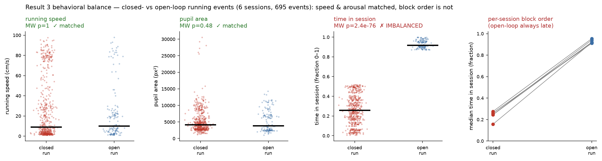

Data in [`data/sensorimotor_behavioral_balance.parquet`](data/sensorimotor_behavioral_balance.parquet);
regenerated (with an optional `REBUILD=True` re-stream from DANDI) by
[`notebooks/robustness_diagnostics.ipynb`](notebooks/robustness_diagnostics.ipynb).

**Time-course diagnostic (four-level PSTH).**

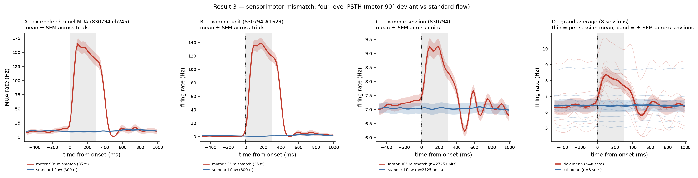

The 90° orientation mismatch drives a clear **sensory** transient above the ongoing standard
flow at every level, with clean trigger alignment. This is the deviant-vs-flow sensory response,
**not** the closed-loop/open-loop contingency contrast (the null above) — it is shown to confirm
the null is not an artefact of a missing or misaligned response.


---

## Result 4 — Sequence mismatch (prediction error in a learned temporal sequence)

Results 1 and 3 define "expected" by frequency (standard-oddball) or motor contingency
(sensorimotor). The sequence paradigm defines it by **learned temporal order**: a fixed
4-element sequence **90° → 45° → 0° → 45°** (each element 267 ms), repeated ~1250 times per
session, so the 3rd element (0°) becomes *predicted* by the two before it. Deviants (35 each)
replace that expected 3rd element with an orientation shift (45°/90°), a blank, or a flow-halt.

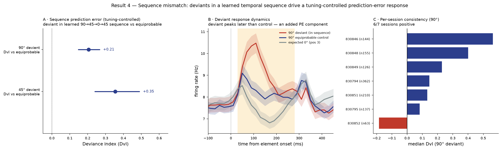

**Tuning-controlled result.** A raw "90°-deviant vs expected-0°" contrast is confounded by
orientation preference (V1 cells respond more to 90° than 0°). We remove it with the same DvI
logic as Result 1 — comparing the sequence deviant to the *physically identical* grating shown
equiprobably in the `sequential_control_block` (matched 0.25 s, TF = 2 Hz), where the same
orientation carries no sequence expectation:

| deviant | DvI (vs equiprobable) | 95 % CI (hierarchical) | mice + (sign test) | pooled-cell p |
|---|---|---|---|---|
| 90° | **+0.20** | [+0.10, +0.31] | 7/7 (p = 0.016) | 8×10⁻¹² |
| 45° | **+0.33** | [+0.07, +0.60] | 5/7 (p = 0.45) | 8×10⁻⁸ |

The CIs here are **hierarchical bootstraps** (resample mice, then units) — the honest cross-animal
intervals, wider than a units-only bootstrap. The **90° deviant is robust at the animal level**
(7/7 mice positive, sign-test p = 0.016; hierarchical CI [+0.10, +0.31] excludes zero). The **45°
deviant is not** (5/7 mice, sign-test p = 0.45): its point estimate is large but the effect is
carried unevenly across animals, so its wide hierarchical CI [+0.07, +0.60] and the pooled-cell p
(8×10⁻⁸) should be read as detection *presence*, not cross-animal generalisation. The pooled-cell
p-values treat ~1,500 cells as independent — descriptive; weigh the per-animal sign test for the
cross-animal claim. A positive DvI means the *sequential context*, not the orientation, drives the
extra response. (All values recomputed from `data/sequence_units.parquet`, the table the
sequence notebook writes; the 90° figure feeds the capstone and per-animal forest.)
The dynamics confirm it: the deviant response peaks later (~110 ms) than the equiprobable control
(~50 ms), a prediction-error component riding on top of the sensory drive — the same signature as
the standard-oddball, now with expectation set by learned order rather than frequency.

**Not overclaimed.** The `sequence_omission` trial type (position 5) is the *fixed* blank ending
every sequence (present in 100 % of them), not a violation — its negative response is loss of
visual drive. And the expected in-sequence 0° is less suppressed than an equiprobable 0° (+0.23),
which resembles predictive suppression but cannot be separated from adaptation to the specific
preceding element, so we rest the result on the confound-controlled DvI. Reproduce:
[`notebooks/sequence_mismatch_ecephys.ipynb`](notebooks/sequence_mismatch_ecephys.ipynb).

**Time-course diagnostic (four-level PSTH).**

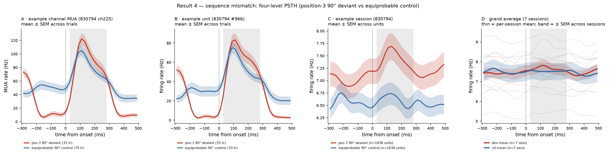

The dynamics carry the story the scalar index cannot: before the position-3 onset the deviant
(red) is *suppressed* — the learned 0° element was expected there — and it then produces a
**later, larger** peak than the equiprobable control (≈110 ms vs ≈50 ms), the delayed
prediction-error component. The pattern holds from the example channel up to the 7-session
grand average.


---

## Result 5 — Duration / timing mismatch (a temporal prediction-error signal)

Despite its name, the "duration" block tests **temporal-interval (timing) expectation**. The
standard is a metronomic cadence — a 367 ms grating every **701 ms**, all at 0° — so the animal
learns exactly *when* the next grating will appear. Deviants perturb the timing: `jitter` makes the
grating arrive early (500 ms) or late (850 / 1370 ms), and `omission` withholds it entirely.

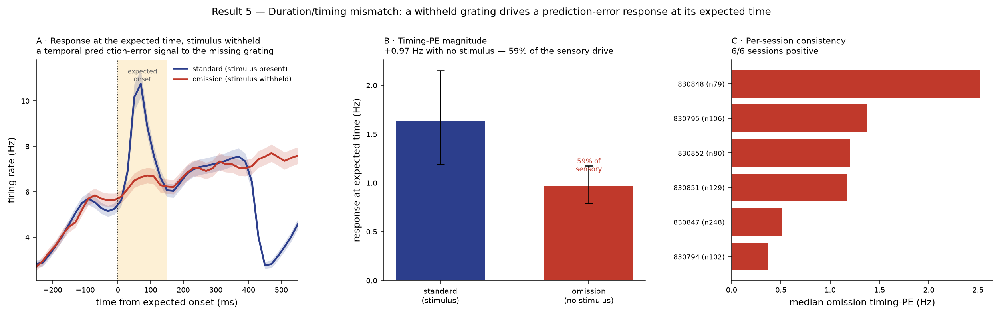

**A withheld stimulus drives a response at its expected time.** When the expected grating is
omitted, the population still produces activity **at the expected onset** — +0.97 Hz (95 % CI
[+0.79, +1.17], p ≈ 9e-60, 74 % of cells positive, 6/6 sessions), which is **~59 % of the
magnitude of the actual sensory response** to a present grating. Panel A shows it directly: the
standard and omission traces rise together on the shared cadence entrainment, then the standard
shoots to its sensory peak while the omission — with no stimulus at all — still shows a clear
positive deflection in the expected window.

**Onset-locked, not entrainment.** The effect survives comparison to the immediately-preceding
window (a positive *step* at the expected onset, +0.33 Hz, p ≈ 2e-25), so it is locked to when the
stimulus should have appeared, not merely the rising cadence ramp.

**Is it *learned* timing, or just cadence / anticipation / drift? Two controls say learned.** The
onset-vs-preceding step rules out a pure rising ramp, but not anticipatory activity keyed to
elapsed time in general. Two further tests isolate *learned* temporal expectation (figure below,
responsive units, hierarchical CIs, n=6 mice):

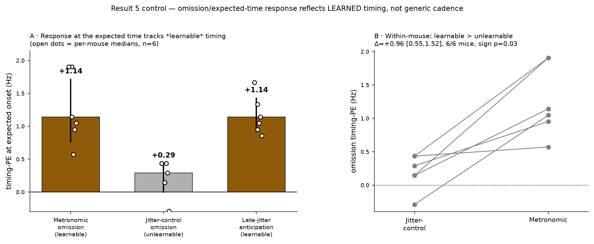

1. **Jitter-control block** (`Control block 3`, `jitter_control`). This block has the *same* stimuli
   but an **irregular** inter-onset interval (median 0.85 s, IQR [0.70, 1.31], std 0.42 s vs the
   metronomic block's std 0.088 s) — so timing *cannot* be learned. It carries its own omissions.
   The omission response at the (best-guess) expected time is **+0.29 Hz** there versus **+1.14 Hz**
   in the metronomic block; the within-mouse difference is **+0.96 Hz (95 % CI [+0.55, +1.52]),
   positive in 6/6 mice (sign test p = 0.031)**. Cadence, drift, and generic anticipation are
   present in *both* blocks, so the ~4× larger response when the interval is *learnable* is
   attributable to learned timing, not to those confounds.
2. **Late-jitter trials** (previously unanalyzed). On late trials the grating is delayed to
   850/1370 ms, leaving the learned ~701 ms expected time stimulus-free. The population produces
   **+1.14 Hz of anticipatory activity at that learned time before the delayed grating arrives**
   (6/6 mice, sign p = 0.031) — an independent "response at the expected time" that matches the
   omission magnitude and uses the trials the earlier analysis had extracted but not used.

We still do not report a *scalar deviant−control* contrast for early/late jitter, because a
mistimed grating shifts the response window into the tail of the previous grating (the baseline
contamination noted before); the late-jitter test above sidesteps this by measuring only the
stimulus-free expected window.

Activity generated by the *absence* of an expected event, keyed to **learned** timing (confirmed
against an unlearnable-timing control), is the strongest form of a prediction-error signal — a
fourth error type pointing the same way as the others.

**Time-course diagnostic (four-level PSTH).**

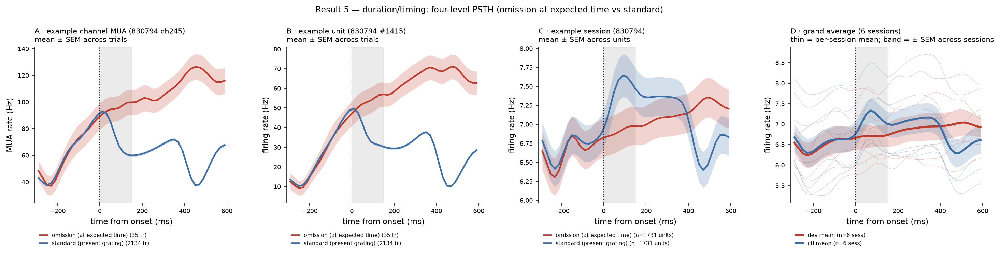

The shaded window is the expected-onset window (0–150 ms). Omission (red) and standard (blue)
rise together on the shared 701 ms cadence entrainment; the standard then peaks and falls as
its grating ends, while the omission holds into the empty expected time — the timing prediction
error. The effect is **modest and carried by the later divergence**, not a sharp early
transient, and the figure shows this honestly (the example session is not the strongest one).
The learned-timing controls (metronomic vs jitter-control, late-jitter anticipation) are the
decisive test and live in the same notebook.

Reproduce:
[`notebooks/duration_mismatch_ecephys.ipynb`](notebooks/duration_mismatch_ecephys.ipynb) (the
learned-timing controls are in
[`data/duration_learnedtiming_v2.parquet`](data/duration_learnedtiming_v2.parquet) and
[`data/duration_latejitter.parquet`](data/duration_latejitter.parquet)).


---

## Result 6 — Is there a shared laminar substrate across error types? (H1 test — inconclusive)

Results 1–5 show that every kind of violated expectation drives a positive prediction-error
response. But "all positive" is equally consistent with H1 (one common deviance-detection
mechanism) and H0 (separate circuits, each tuned to its own error type). The test that
distinguishes them: **do the same anatomical populations carry different error types?** Five
animals (830794, 830795, 830848, 830851, 830852) were recorded across the feature-oddball,
sequence, and duration paradigms — in separate sessions, but with probes targeting the same
visual areas — so we can compare the PE's anatomical profile across error types using the CCF
area/layer labels.

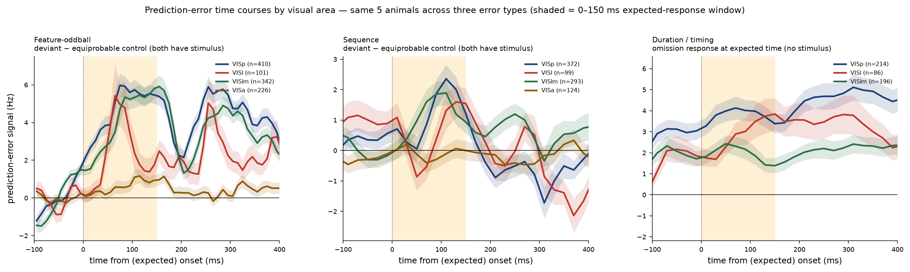

The time courses (deviant − matched control, in Hz, same 5 animals) show the actual PE dynamics
per area, not a collapsed summary. VISa is consistently the weakest carrier; VISp/VISl/VISlm carry
the bulk of the signal in all three paradigms. (The duration panel plots the omission's response
at the expected time — the correct analog of "extra response to the unexpected event," since the
omission has no stimulus to subtract.)

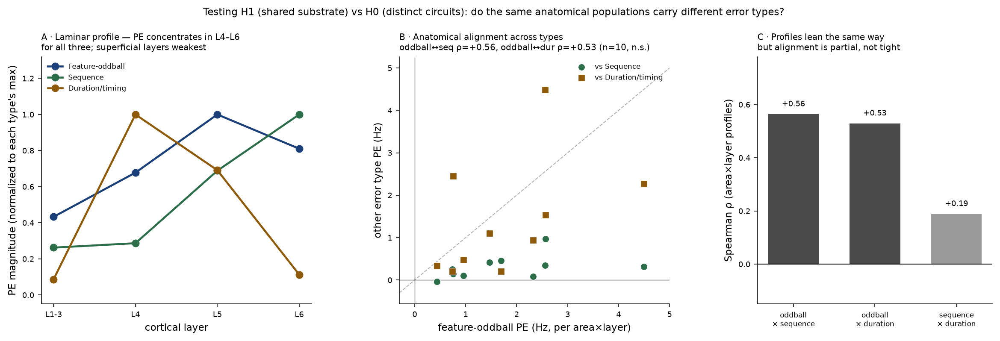

**The laminar pattern depends on the metric — shown both ways.** On the *same* feature-oddball
units the two metrics point in **opposite** directions, so neither alone establishes a shared
laminar signature:

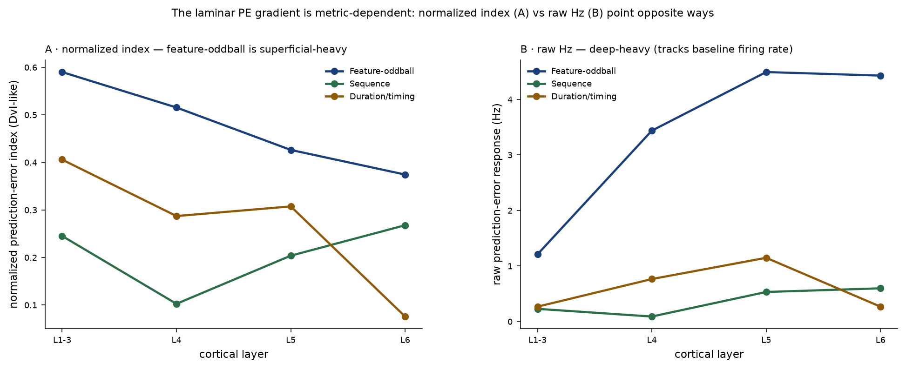

- **Normalized index (DvI-like — the repo's primary metric, panel A):** feature-oddball is
  **superficial-heavy** (L2/3 ≈ +0.59 → L6 ≈ +0.37), consistent with Result 1's by-layer DvI.
  Sequence and duration are flat-to-mixed with no clean gradient.
- **Raw Hz (panel B):** feature-oddball is **deep-heavy** (L1–3 ≈ 1.2 Hz → L5 ≈ 4.5 Hz) — but this
  simply tracks that deep layers fire harder, so a raw-Hz "PE" is largest wherever baseline firing
  is largest. Normalizing by response magnitude (which is what DvI does) removes that and flips the
  gradient.

So the direction of the laminar gradient is an artifact of which metric you plot — the normalized
DvI (Result 1's superficial-heavy gradient) and raw Hz describe the same units through different
lenses. Both are shown rather than asserting one as "the" laminar signature.

**What the cross-paradigm correlation actually shows.** At full area×layer resolution the raw-Hz
profiles *lean* the same way — feature-oddball vs sequence Spearman ρ = +0.56 (p = 0.09), vs
duration ρ = +0.53 (p = 0.12), sequence vs duration ρ = +0.19 (p = 0.60) — but with
Benjamini–Hochberg FDR across the three tests **none is significant** (q = 0.17, 0.17, 0.60), and
the whole comparison rests on only **n = 10 pooled anatomical cells with no animal-level
uncertainty**. The peak layer differs across types (oddball L5, sequence L6, duration L4), and the
duration signal is a raw omission Hz while the other two are deviant-minus-control — so the profiles
are not even on the same footing.

**How thin the anatomy actually is.** The heatmap below makes the sampling explicit: each
area×layer cell shows its median DvI *and the number of contributing mice* (not units).
Only VISp is broadly supported (6–9 mice across the three paradigms); most non-V1 cells rest on
1–5 mice, and the eye-catching negative cells (feature-oddball VISa −0.10; sequence VISl L4 −0.58,
VISrl L4 −0.67) are all **single-mouse** cells, hatched here to recede. This is why the laminar
comparison is presented as inconclusive rather than as a result — outside V1 the per-cell estimates
are carried by too few animals to trust a gradient.

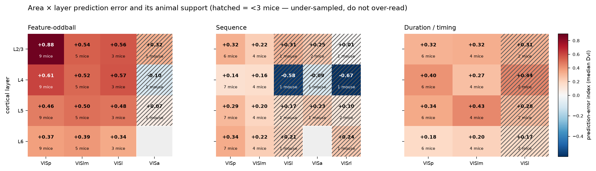

Per-cell values and animal counts in
[`data/area_layer_animal_support.csv`](data/area_layer_animal_support.csv); regenerated by
[`notebooks/robustness_diagnostics.ipynb`](notebooks/robustness_diagnostics.ipynb).

**Bottom line for H1 vs H0.** This analysis does **not** distinguish a common H1 mechanism from
different circuits that each happen to produce a positive average response. The evidence for H1
elsewhere in the repo is that four qualitatively different violations all yield positive prediction
error; the *laminar* argument for a single shared substrate is not supported by these data. A clean
test would need the same units recorded across paradigms in one session — which this dataset does
not provide — or many more CCF sessions. Reproduce:
[`notebooks/h1h0_shared_substrate_ecephys.ipynb`](notebooks/h1h0_shared_substrate_ecephys.ipynb);
profiles in [`data/h1h0_laminar_profiles.csv`](data/h1h0_laminar_profiles.csv) and
[`data/h1h0_area_layer_profiles.csv`](data/h1h0_area_layer_profiles.csv).

**Laminar time-course diagnostic (PE by layer).** The scalar profile is complemented by the
prediction-error *time-course* in each coarse layer group, per error type (VIS units, mean ± SEM,
pooled over the 5 shared animals):

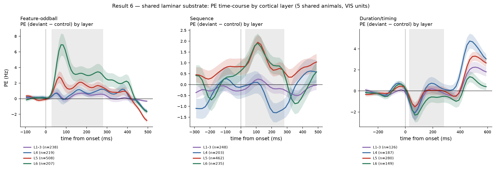

These time-courses are in **absolute Hz (deviant − control)**, so they share the raw-Hz metric's
bias toward deep layers (which fire harder). Read that way, **feature-oddball** shows a clean
ordering — L5/L6 largest, superficial weakest — while **sequence** and **duration** are much more
mixed (the duration divergence is largely *post*-window, reflecting the omission's late build to the
expected time). Only one of the three paradigms shows a clean laminar ordering even on the raw
metric, and that ordering is the opposite of the normalized-index gradient (panel A above) — so the
time-courses do **not** establish a shared laminar signature; they illustrate the same
metric-dependence and paradigm heterogeneity as the scalar analysis.

---

## Result 7 — Paradigm-matched SLAP2, first look (preliminary, n=2/paradigm)

The SLAP2 dendritic-glutamate dataset (DANDI 001424, iGluSnFR) was originally a single
monolithic gratings stream. **3 subjects** (828408 / 828409 / 829704) now
carry the **same named-block design** as the Neuropixels and mesoscope datasets — 2 sessions
each of standard-oddball, sequence, duration, and sensorimotor. This is the four-paradigm SLAP2
set that was "expected in a later release," and it has begun to arrive. (A 2026-08-08 DANDI check
found 5 further SLAP2 subjects, but they remain in the older RF/tuning gratings-stream format with
no named paradigm blocks — so Result 7 is still limited to these 2 paradigm-matched sessions per
type.) We compute the prediction-error index in each paradigm at dendritic-glutamate resolution
for the first time.

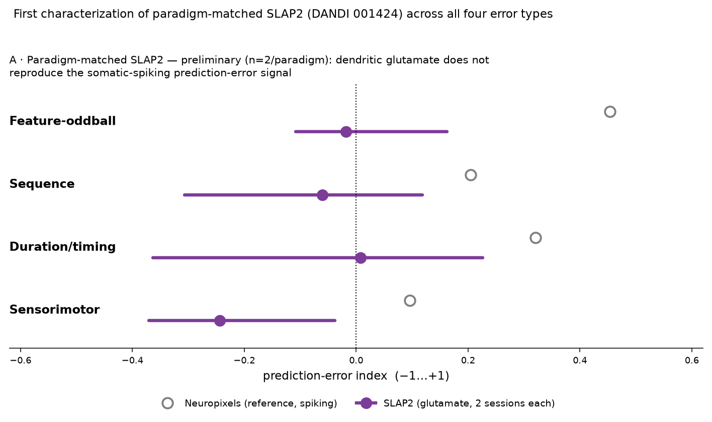

**At n = 2 sessions per paradigm the SLAP2 data are uninformative — no paradigm shows the positive
prediction-error index that Neuropixels spiking shows, but the honest reading is "cannot tell yet,"
not "reproduces a null."** The pooled medians sit at or below zero
(oddball −0.02, sequence −0.06, duration +0.01, sensorimotor −0.24). With only two sessions we
report the **two per-session medians** rather than a bootstrap CI (a within-subject ROI bootstrap
would omit the between-animal variance that dominates at n = 2 and give a spuriously tight
interval). The per-session values are wide apart — e.g. sequence −0.79 / +0.01, sensorimotor
+0.04 / −0.44 — which is exactly why no CI is warranted yet. This extends the Result 2 cross-scale
finding (imaging modalities show weak/absent oddball effects) to the dendritic-glutamate scale
and to the non-oddball paradigms.

**This is explicitly preliminary and we do not over-read it.** A null at n = 2 has two candidate
explanations that this sample cannot separate: (i) a genuine dissociation between input glutamate
(iGluSnFR, dendritic) and somatic spiking output — plausible, since the two measure different
stages of the same circuit — or (ii) simple underpowering. The sensorimotor contrast is the
weakest of the four (only ~5 open-loop running events per session, the same locomotion limit as
Result 3), so its apparent negative value should not be read as a real suppression. The SLAP2
dataset is actively growing; this analysis is built to re-run as the paradigm-matched set expands.
**Time-course diagnostic (four-level PSTH, ΔF/F).** Shown for the standard-oddball paradigm (the one
with a matched equiprobable control):

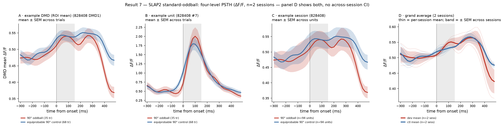

The iGluSnFR signal responds clearly and is well-triggered (clean transient at onset, ~200 ms
glutamate kinetics) — the pipeline reads a real visual response. But the 90° oddball (red) does
**not** exceed the equiprobable control (blue); if anything the control is marginally higher in the
window. That is the time-course form of the near-zero oddball DvI. Panel D shows the two sessions as
separate lines — at n=2 there is no meaningful across-session interval, and the figure is labelled
accordingly.

Reproduce:
[`notebooks/slap2_fourparadigm_ecephys.ipynb`](notebooks/slap2_fourparadigm_ecephys.ipynb);
values in [`data/slap2_fourparadigm_summary.csv`](data/slap2_fourparadigm_summary.csv).

---

## Result 8 — Sequence-mismatch: a cross-modality areal discrepancy in V1

Result 4 established a robust sequence prediction-error signal in Neuropixels spiking
(pooled DvI ≈ +0.21). Does it survive in mesoscope 2-photon? Answering this correctly requires
breaking **both** modalities down by cortical area — and when we do, the two do **not** agree
where it matters most.

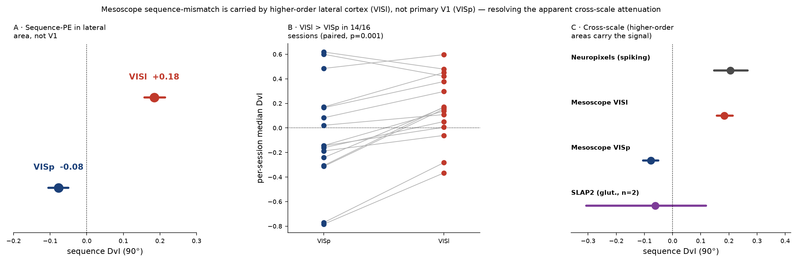

Comparing the same paradigm (position-3 90° deviant vs. the equiprobable Control-block-2 90°
control, same DvI) in the two areas mesoscope samples. All CIs are **hierarchical bootstraps**
(resampling sessions, then units) so between-session variance is included:

| area | **Neuropixels** DvI (90°) | **Mesoscope** DvI (90°) |
|---|---|---|
| **VISp** (primary V1) | **+0.25** [+0.01, +0.40] — *significant, strongest area* | **−0.03** [−0.25, +0.20] — **null** |
| **VISl** (lateral) | +0.18 [−0.01, +0.33] — n.s. (n=405) | +0.19 [+0.05, +0.31] — significant |

*(Mesoscope updated to the full 10-subject cohort now on DANDI — subjects 850399 and 853137 were
added since the first pass. The extra two mice pull VISp from −0.08 to −0.03, i.e. **closer to
zero**; the picture is a spiking/imaging **detection** difference in V1, not a sign reversal.)*

**In V1 the spiking signal is significantly positive while 2-photon is a null.** Spiking finds
the sequence-PE *strongest* in primary V1 (+0.25, significant, present across all areas);
mesoscope 2-photon in V1 sits essentially on zero (−0.03, wide CI spanning zero; 4 of 10 subjects
negative, 6 positive — no consistent sign once between-subject variance is counted). So the honest
statement is a **cross-modality discrepancy in V1**: the
spiking deviance signal that is strong and significant in V1 does not appear in the 2-photon
signal there. Note this is a **detection difference, not a sign reversal**: with the full
10-subject cohort the mesoscope V1 estimate is −0.03 (essentially zero), not a negative effect.
In VISl the two modalities *agree* — both positive, +0.18 (Neuropixels) vs +0.19
(mesoscope) — though the Neuropixels VISl estimate is not itself significant (its CI just
includes zero even at n=405 under the corrected probe mapping). The same direction holds for
feature-oddball (Result 1): Neuropixels V1 is the strongest area (+0.49), while mesoscope
feature-oddball is weak pooled (Result 2, +0.11).

**Is it just laminar sampling?** Mesoscope images ~46–428 µm (L2/3 through upper L5, **missing
L6**), while Neuropixels samples all layers. The Neuropixels V1 sequence-PE *is* deep-biased
(L5 +0.29, L6a +0.33, L6b +0.56 vs. L4 +0.14; panel B), so depth explains part of the magnitude
gap. Restricting Neuropixels
V1 to the superficial layers mesoscope can see gives +0.19 (point estimate positive) versus
mesoscope's −0.03 — but with the honest hierarchical CI this superficial-matched comparison is
**underpowered** (wide interval crossing zero), so depth-matching neither rescues nor cleanly
refutes the discrepancy. What is robust is the *full-population* contrast: spiking V1 significantly
positive, 2-photon V1 null.

**What this means.** The calcium DvI is **not interchangeable** with the spiking DvI —
especially in V1, where a strong spiking deviance signal (concentrated in deep layers) does not
appear in the superficial 2-photon signal. Candidate causes this dataset cannot yet
adjudicate: indicator nonlinearity/thresholding suppressing small deviance signals, neuropil
contamination, or a genuine transformation between somatic spiking output and the dendritic/
somatic calcium proxy.

> **Important caveat — this comparison is *not* tuning/responsiveness-balanced, and Result 2 shows
> that matters.** Result 2 demonstrates that raw cross-technique indices are dominated by
> tuning-biased cell sampling (the oddball index swings from −1.0 to +0.16 only after joint
> balancing). Result 8 compares raw per-ROI and per-unit DvIs **without** that balancing: the
> mesoscope side has no responsiveness floor (near-zero ROIs push the DvI toward ±1 on noise), and
> the large n-asymmetry (VISp: 580 spiking units vs 18,690 mesoscope ROIs across 10 mice) alone drives part of the
> "spiking n.s. / mesoscope tight" contrast. So the V1 sign discrepancy is real *in these raw
> indices*, but the sampling/normalization explanation has **not** been ruled out. Treat Result 8 as
> a flag for a balanced cross-modality re-analysis, not an established biological dissociation.

This is a caution for anyone pooling deviance indices across techniques,
and it sharpens (rather than resolves) the cross-scale question raised in Results 2 and 7.
A per-subject magnitude spread sits on top of the area pattern (a few mesoscope sessions are
negative in both areas) — a candidate for a behavioral-state analysis as more data accrues.

**Time-course diagnostic (four-level PSTH, ΔF/F).**

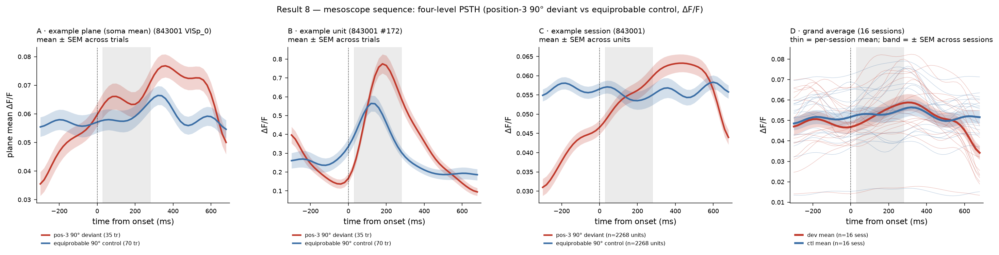

The example plane and ROI (panels A–B) show a clean, well-triggered ΔF/F transient with the
expected ~200 ms calcium rise, and a strongly-positive example session (panel C). But the grand
average (panel D) makes the **between-session heterogeneity** undeniable: the per-session means
(thin) span far above and below zero and the deviant/control bands overlap — this is the visual
form of the weak, sign-inconsistent pooled DvI. The dynamics confirm the mesoscope sequence signal
does not robustly replicate the tight positive Neuropixels effect; the areal split (VISl positive,
VISp not) is what structures the mess, not a uniform attenuation.

Reproduce: [`notebooks/mesoscope_sequence_area.ipynb`](notebooks/mesoscope_sequence_area.ipynb)
computes **both** sides — the mesoscope area DvI *and* the Neuropixels area/layer/superficial
breakdown (exact probe→area mapping, `default_qc` responsive units, hierarchical CI) — and writes
both CSVs on a full run (QUICK mode is a result-blind first-N preview and does not overwrite the
authoritative tables). Values in
[`data/seq_area_comparison.csv`](data/seq_area_comparison.csv) and
[`data/seq_visp_layers.csv`](data/seq_visp_layers.csv).

---

## Cross-technique methods — why the raw numbers mislead, and how we correct

The single most important thing to understand before comparing responses across
these three techniques: **they do not sample neurons the same way**, so a raw
response comparison across them is not meaningful. This section measures the
difference and gives the correction — the reusable methodological core of the
oddball work.

### Why the mesoscope differs — four compounding factors

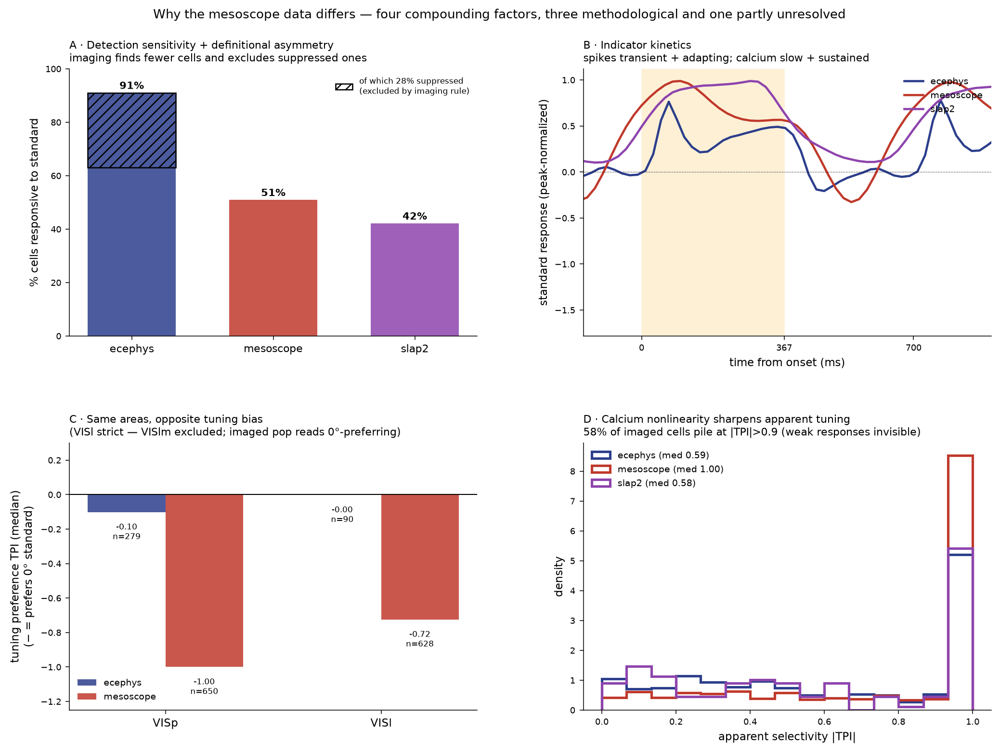

1. **Detection sensitivity.** Neuropixels finds ~91 % of visual units responsive to
   the standard; mesoscope ~51 %, SLAP2 ~42 %. Calcium imaging only sees cells whose
   spiking crosses the indicator threshold, dropping the weakly-driven majority.
2. **A definitional asymmetry.** The ephys responsiveness rule (Wilcoxon p<0.05)
   admits suppressed-by-standard cells (28 % of responsive ephys units); the imaging
   rule (p<0.05 **and mean>0**) excludes them.
3. **Indicator kinetics.** Spikes are transient and adapting; calcium is slow and
   sustained. The standard trace dips below baseline late in ephys but stays
   elevated in calcium.
4. **Calcium nonlinearity sharpens apparent tuning.** 58 % of mesoscope cells pile
   at |TPI|>0.9 vs 37 % in ephys — a cell responds to its preferred orientation and
   goes *invisible* for the orthogonal one, saturating the tuning index toward ±1.
   (The mesoscope images depths 62–385 µm, superficial through L5, so this is *not* a
   layer artifact — it is technique-intrinsic.)

### The mechanism of the OI reversal — a tuning-sampling effect

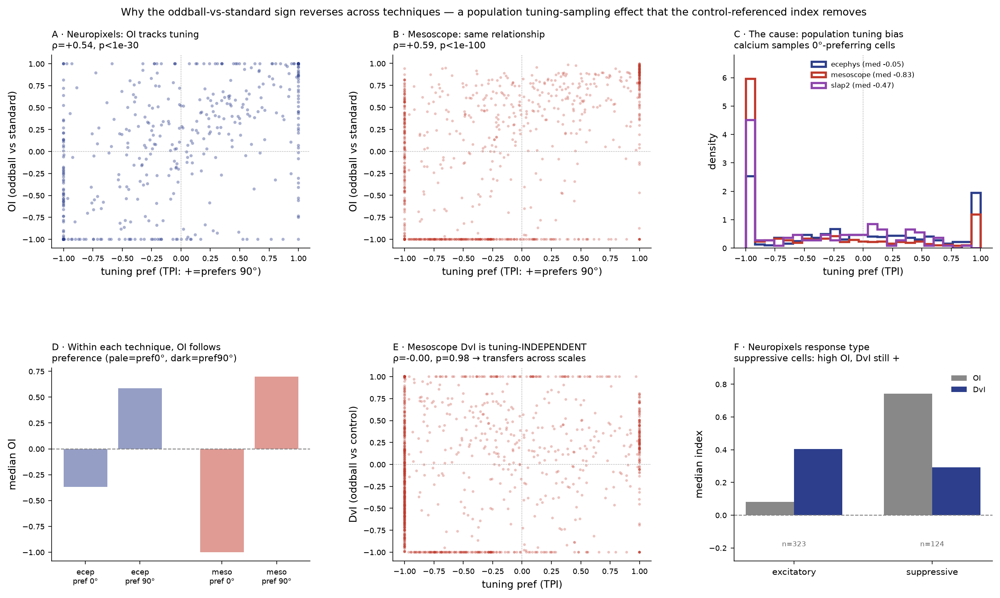

Factor 4 is the proximate cause of the −1.00 raw mesoscope OI, and the mechanism is
clean: **OI tracks each cell's orientation preference**, measured *independently* in
the control block (TPI: +1 = prefers the 90° deviant orientation, −1 = prefers the
0° standard). Within *every* technique, OI correlates with TPI (Neuropixels ρ =
+0.54, mesoscope ρ = +0.59, both p ≪ 1e-30). Two-photon imaging over-samples
0°-preferring cells (mesoscope median TPI −0.83 vs Neuropixels −0.05), which drags
the population-median OI negative even though individual cells obey the same law —
split by preference, the reversal vanishes (0°-cells negative, 90°-cells positive in
*both* techniques). The adaptation-controlled **DvI is tuning-independent** (ρ =
−0.00, p = 0.98), which is exactly why it transfers across scales and OI does not.

### The correction principle — match responsiveness AND tuning

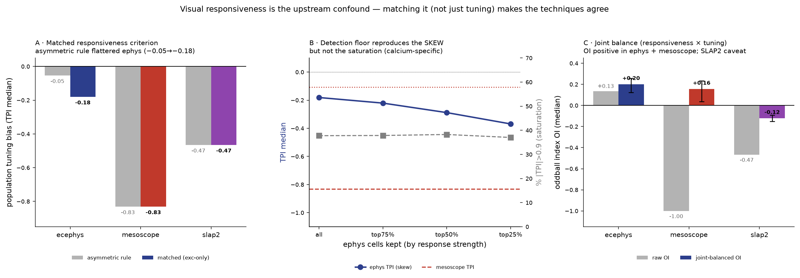

> **Cross-technique comparisons must be matched on both what fraction of cells you
> detect (the responsiveness floor) and which cells among them you keep (the tuning
> distribution).** Controlling tuning alone is insufficient, because the detection
> threshold silently pre-selects a tuning-biased subset.

Three levels, applied to the feature-oddball index:

1. **Matched responsiveness criterion.** Applying the same excitatory-only rule to
   all three techniques moves the ephys tuning bias from −0.05 to −0.18 — the
   asymmetric rule had flattered ephys. DvI is untouched (+0.39 → +0.40).
2. **Detection-floor test.** Restricting ephys to progressively
   stronger-responding cells *trends* its tuning bias toward the mesoscope's (TPI
   −0.18 → −0.37 at the strongest quartile), showing the skew is partly a shared
   detection-threshold effect. The imaging-matched ~50 % fraction alone does **not**
   flip ephys OI negative (still +0.03); only a stricter cut does. The calcium
   *saturation* (|TPI|>0.9 ≈ 58 %) is not reproduced at any ephys threshold — that
   piece is calcium-specific.
3. **Joint balancing (responsiveness × tuning).** Balancing on both flips the
   mesoscope OI from −1.00 to **+0.16** (95 % CI [+0.04, +0.23]) and gives ephys
   +0.20 — both positive under the fully-matched comparison. (An independent
   tuning-only balancing gives the same qualitative flip; see
   [`notebooks/subsample_tuning_balanced.ipynb`](notebooks/subsample_tuning_balanced.ipynb).)

**SLAP2 caveat throughout:** with no equiprobable control block, its tuning index
and its oddball index derive from the same 0°-vs-90° comparison, so the two cannot
be separated there (balanced OI stays −0.12). The clean dissociation rests on
Neuropixels + mesoscope; SLAP2's positive evidence is the tuning-free omission.

### Time series, and the adaptation control for omission

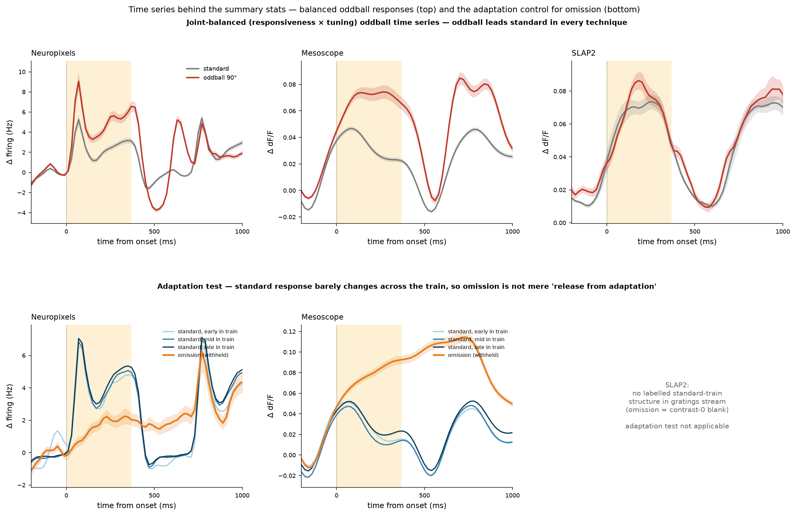

Summary indices can mislead, so the joint-balanced result is also shown as
time-courses (top row): the oddball leads the standard throughout the window in
every technique, including the mesoscope whose raw OI was −1.00.

The bottom row is the **adaptation control** for the omission response — the
alternative a reviewer would raise: is the large, positive mesoscope omission
response merely *release from adaptation*? If so, the standard should decline across
the standard train and the omission should not exceed the un-adapted (early)
standard. **Neither holds.** Splitting the standard by train position, the traces
are essentially superimposed — no adaptation (mesoscope 0.018 → 0.016 → 0.022 dF/F;
ephys 4.1 → 4.6 Hz) — and the omission (0.088 dF/F) exceeds even the earliest,
least-adapted standard (0.018) by ~4–5×. There is no adaptation to release from, and
the response dwarfs what it would release toward: an active, positively-signed
prediction-error signal. Full analysis:
[`notebooks/crosstechnique_corrections.ipynb`](notebooks/crosstechnique_corrections.ipynb).

---

## Install

```bash
pip install -e .
```

## Quick start

```python
import openscope_ccf as o

idx = o.load_session_index()          # registry of CCF-labeled sessions
row = idx.iloc[0]
tag = f"{row.subject}_{row.date}"

# 1. Build attachable sidecars for a session
o.build_session_sidecars(row.aid, str(row.subject), row.date, row.paradigm)

# 2. Annotate any unit-level result
annotated = o.attach(my_sua_df, tag, on="unit_index")      # adds area, layer, group, ccf_xyz
# ...or any channel-level (LFP/CSD) result:
annotated = o.attach(my_lfp_df, tag, on="channel", kind="channels")

# 3. Penetration figures
pd_ = o.build_probe_data(row.aid)
o.make_3d(pd_, tag, "fig_3d.png", brain_mesh=o.load_root_mesh())
o.make_laminar(pd_, tag, "fig_laminar.png")
```

## Colab

`notebooks/ccf_penetration_figures.ipynb` runs the whole flow for any session on
free Colab CPU (data is streamed, not downloaded).

## Batch

```bash
python scripts/build_all.py --sidecars --figures --out data/
```

## Layout

```
openscope_ccf/          package
  ccf.py                CCF acronym decoder
  nwbio.py              DANDI streaming + corrected unit→electrode mapping
  sidecar.py            build/load/attach sidecar tables
  figures.py            build_probe_data, make_3d, make_laminar
  provenance.py         asset SHA-256 + code SHA + params -> JSONL manifest
  data/ccf_session_index.csv   registry of CCF sessions
  data/sidecars/          prebuilt sidecars (Parquet) for 30 of the 58 CCF sessions; others build on demand
notebooks/              Colab notebooks (CCF figures, validation, prediction-error analyses)
tests/                  offline pytest suite (decoding, unit→electrode mapping, sidecar integrity, provenance)
scripts/build_all.py    batch driver
scripts/rebuild_session_index.py  re-sweep DANDI 001637 -> ccf_session_index.csv
scripts/audit_locomotion.py       score sensorimotor sessions on open-loop running
```

`rebuild_session_index.py` re-derives the registry from the live dandiset, so the
index tracks new uploads instead of going stale. `audit_locomotion.py` scores every
SENSORYMOTOR session on the criterion that gates Result 3 — how many of the 8
`Control block 4` open-loop events per deviant type occurred while the animal was
running (>1 cm/s in the preceding 1 s).

`load_ccf`/`attach` resolve sidecars from `./data/sidecars` if present, else fall
back to the copy shipped inside the installed package — so they work from a clone
or a bare `pip install`.

## Data & attribution

- Data: OpenScope Community Predictive Processing, [DANDI 001637](https://dandiarchive.org/dandiset/001637).
- CCF alignment: OpenScope community ([discussion #163](https://github.com/AllenNeuralDynamics/openscope-community-predictive-processing/discussions/163)).
- Atlas: `allen_mouse_25um` via [BrainGlobe](https://brainglobe.info/).

## Testing

An offline `pytest` suite (`tests/`) pins the package's correctness properties and
runs in seconds with no DANDI streaming:

- **CCF decoding** — layer splits, hippocampal subfields, fiber tracts, and the two
  regressions the audits caught: `"unknown"` decodes to *unassigned* (not grey), and
  a missing/`NaN` acronym decodes to *unassigned* rather than raising.
- **`unit_electrode_rows`** — the per-probe offset is applied correctly, and invalid
  anatomy (out-of-range or negative channel index, non-contiguous probe block, unknown
  device) **raises** instead of silently remapping.
- **Shipped sidecars** — the 30 pairs have unique/contiguous keys, row counts match
  `_manifest.csv`, and re-running `decode_ccf` on each stored acronym reproduces the
  stored area/layer/group/tissue exactly.

```bash
pip install -e ".[dev]"
pytest -q
```

CI runs this on every push and PR across Python 3.9/3.11/3.12
(`.github/workflows/tests.yml`).

## Provenance & reproducibility

Because 001637 is a **mutable draft** (asset ids are re-minted on re-upload), resolving
a session by path at run time is convenient but is not, by itself, a reproducible pin.
`openscope_ccf.provenance` records what was actually read so a result can be traced to an
immutable content state even after the draft moves:

```python
from openscope_ccf import provenance_record, append_manifest
rec = provenance_record("830794", "2026-01-26-12-02-05", params={"resp_win": [0, 0.3]})
append_manifest(rec, "data/sidecars/provenance.jsonl")
```

Each record carries the resolved `asset_id`, the asset's **SHA-256 content digest** and
byte size (from DANDI metadata — no download), the `dandiset`/`version`, the repo
`code_sha`, the analysis `params`, and a UTC timestamp. `build_session_sidecars`
appends one automatically to `<outdir>/provenance.jsonl`, so a batch build accumulates a
full provenance log alongside the sidecars.

## Notebook hygiene (Colab ↔ GitHub)

Saving a notebook from Colab can insert a `metadata.widgets` block without the
required `state` key, which makes GitHub refuse to render it ("Invalid Notebook").
`scripts/clean_notebook.py` strips only that block — **figures and all other
outputs are preserved** (unlike "Clear all outputs", which deletes them).

Two layers keep this automatic:

* **Local pre-commit hook** — `pip install pre-commit && pre-commit install`, then
  every local `git commit` cleans notebooks first (see `.pre-commit-config.yaml`).
* **GitHub Action** — `.github/workflows/clean-notebooks.yml` cleans and commits
  back on any pushed notebook, which covers saving from Colab straight to GitHub
  (that path bypasses local hooks).

**Committed notebooks are stored un-run** (no cell outputs), except
`ccf_penetration_figures.ipynb`. This is deliberate — the figures and CSVs they produce are
committed under `figures/` and `data/`, and every analysis notebook defaults to `QUICK = False`,
so a clean **Run All** regenerates the committed artifacts (streaming the NWB files from DANDI;
allow several minutes per notebook). Set `QUICK = True` for a fast 3-session preview, which does
**not** reproduce the committed full-cohort numbers.

## License

MIT — see [LICENSE](LICENSE).
